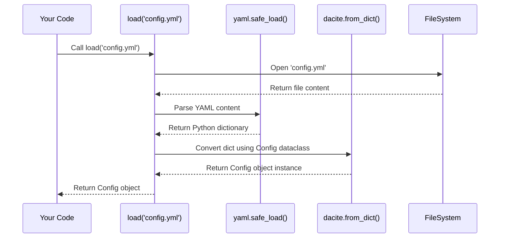

# Chapter 1: Configuration System

Welcome to the Feluda Documentation! We're excited to guide you through how Feluda works, starting right here with the basics.

Imagine you're building something complex, like a custom computer or even assembling furniture from a kit. You wouldn't just start connecting wires or screwing pieces together randomly, right? You'd need a plan, an instruction manual, or a blueprint that tells you exactly which parts to use and how they connect.

Feluda, being a powerful system for processing media, also needs such a blueprint. This blueprint tells Feluda exactly how it should be set up and run. That's where the **Configuration System** comes in.

**What Problem Does Configuration Solve?**

Think about setting up a Feluda project. You might need to tell it:

*   "Use *this specific* database to store information."
*   "Connect to *this specific* messaging system to handle tasks."
*   "Activate *these particular* tools (we call them Operators) to process images or videos."
*   "Start a web server on *this specific* port number."

Instead of writing all these instructions directly into the main code (which would make it messy and hard to change), Feluda uses a dedicated configuration system.

**The Blueprint: `config.yml`**

Feluda's blueprint is usually stored in a file named `config.yml`. YAML (YAML Ain't Markup Language) is a human-friendly format for writing down configuration settings. It uses indentation (spaces) to structure data, making it easy to read.

Let's look at a very simple example snippet from a potential `config.yml`:

```yaml
# config.yml (Simplified Example)

server:
  label: 'web_interface'
  parameters:
    port: 8000
    type: 'fastapi'

store:
  label: 'main_storage'
  entities:
    - label: 'es_datastore'
      type: 'elasticsearch'
      parameters:
        host_name: 'localhost:9200'
        image_index_name: 'feluda_images'
        # ... other index names ...
```

*   This file defines settings for a `server` and a `store`.
*   Under `server`, it specifies a `port` (8000) and a `type` ('fastapi').
*   Under `store`, it defines one storage entity (`es_datastore`) of type `elasticsearch` and provides connection details like the `host_name`.

This `config.yml` file acts as the single source of truth for how Feluda should be configured for a specific deployment.

**From Blueprint File to Usable Code Instructions**

Okay, so we have this nice `config.yml` file. But how does our Python code actually *use* these settings? Reading a file and figuring out "port is 8000" every time we need it can be clumsy.

Feluda does something clever: it reads the `config.yml` file *once* when it starts up and translates the YAML structure into structured Python objects. Specifically, it uses **dataclasses**.

**What are Dataclasses?**

Think of dataclasses (available in Python) as simple boxes designed to hold specific pieces of data, where each piece has a name and an expected type. They make organizing and accessing data within your code much cleaner and safer.

For example, Feluda defines dataclasses that mirror the structure of the `config.yml`. Looking at the code snippets provided:

```python
# From feluda/config.py (Simplified)
from dataclasses import dataclass
from typing import List, Optional

@dataclass
class ServerParameters:
    port: int  # Expects an integer for the port
    type: str  # Expects a string for the type

@dataclass
class ServerConfig:
    label: str
    parameters: ServerParameters # Contains ServerParameters object

# ... other dataclasses like StoreConfig, QueueConfig etc. ...

@dataclass
class Config:
    # These can be Optional (might not be present in config.yml)
    store: Optional[StoreConfig]
    queue: Optional[QueueConfig]
    server: Optional[ServerConfig]
    operators: Optional[object] # Simplified for now
```

*   `ServerParameters` is a dataclass designed to hold the `port` (as an integer) and `type` (as a string).
*   `ServerConfig` holds a `label` and an instance of `ServerParameters`.
*   The main `Config` dataclass holds optional instances of configurations for `store`, `queue`, `server`, and `operators`.

**Loading the Configuration**

Feluda provides a function to handle the loading and translation process.

```python
# From feluda/config.py
import yaml
from dacite import from_dict # A helper library
# ... import Config dataclass ...

def load(filepath) -> Config:
    log.info("Loading config from " + filepath)
    with open(filepath) as f:
        # 1. Read the YAML file into a Python dictionary
        parameters = yaml.safe_load(f)
    # 2. Convert the dictionary into nested dataclass objects
    config = from_dict(data_class=Config, data=parameters)
    # 3. Return the structured Config object
    return config

# How you might use it in your main script:
# config_data = load("config.yml")
# print(f"Server will run on port: {config_data.server.parameters.port}")
```

1.  The `load` function takes the path to your `config.yml` file.
2.  It opens the file and uses the `yaml` library to parse the YAML content into a standard Python dictionary.
3.  It then uses a helpful library called `dacite` to automatically convert that dictionary into an instance of our main `Config` dataclass, filling in all the nested dataclasses like `ServerConfig` and `ServerParameters` along the way.
4.  Finally, it returns this `Config` object.

Now, anywhere in your Feluda code, you can access configuration values easily and safely, like `config_data.server.parameters.port`. Your code editor might even help you with auto-completion because it knows the structure and types defined in the dataclasses!

**Why is this approach useful?**

*   **Centralized & Readable:** All settings are in one human-readable `config.yml` file. Easy to find, easy to change.
*   **Structured in Code:** Settings are accessed via clear object attributes (`config.server.parameters.port`) instead of messy dictionary lookups (`config['server']['parameters']['port']`).
*   **Type Safety:** Dataclasses define expected data types (like `port: int`). If your `config.yml` has `"8000"` (a string) instead of `8000` (a number) where an `int` is expected, you might catch errors earlier (though `dacite` might perform some conversions; strong validation is a potential future improvement mentioned in the code comments). It also prevents typos in configuration keys within the code.

**Key Parts of the Configuration**

The main `Config` object can hold settings for several core Feluda components:

*   `store`: Defines where and how Feluda stores data (like databases). We'll explore this in [Stores](04_stores_.md).
*   `queue`: Sets up messaging queues for handling tasks asynchronously. See [Queues](07_queues_.md) and [Workers](08_workers_.md).
*   `server`: Configures the web server for receiving requests. See [Server & Endpoints](05_server___endpoints_.md).
*   `operators`: Lists the specific processing tools (like image classifiers or video analysers) Feluda should use. See [Operators](03_operators_.md).

The `config.yml` file tells Feluda *which* of these components to activate and *how* they should behave.

**Under the Hood: The Loading Process**

Let's visualize the `load` function step-by-step:

1.  **You Call `load`:** Your code asks the configuration system to load settings from a file (e.g., `config.yml`).
2.  **File Reading:** The system opens and reads the content of the `config.yml` file.
3.  **YAML Parsing:** The `pyyaml` library parses the text content, understanding the indentation and structure, turning it into a Python dictionary.
4.  **Dictionary-to-Object Conversion:** The `dacite` library takes this dictionary and the main `Config` dataclass structure. It intelligently matches dictionary keys to dataclass fields, creating instances of `Config` and all the nested dataclasses (`ServerConfig`, `StoreConfig`, etc.), filling them with the values from the dictionary.
5.  **Return Object:** The fully populated `Config` object is returned to your code.

Here's a simple diagram illustrating this:



The core magic happens in these lines within the `load` function (from `feluda/config.py`):

```python
# Simplified from feluda/config.py

def load(filepath) -> Config:
    # ... (logging) ...
    with open(filepath) as f:
        # Use the yaml library to read the file content
        # into a standard Python dictionary.
        parameters = yaml.safe_load(f)

    # Use the dacite library to map the dictionary
    # keys/values onto the structure of the Config dataclass.
    config = from_dict(data_class=Config, data=parameters)

    return config
```

*   `yaml.safe_load(f)`: Reads the file `f` and converts the YAML text into a Python dictionary called `parameters`.
*   `from_dict(data_class=Config, data=parameters)`: Takes the `Config` dataclass definition and the `parameters` dictionary, then automatically creates a `Config` object populated with the data.

**Conclusion**

The Configuration System is the starting point for any Feluda application. It provides a clean, readable, and type-safe way to define *how* Feluda should run by loading settings from a `config.yml` file into structured Python dataclasses. This makes managing different setups (development, testing, production) much easier and less error-prone.

You now understand how Feluda gets its initial instructions. Next, we'll dive into one of the core concepts Feluda deals with: different types of media.

Ready to move on? Let's explore [Media Handling (Types & Factory)](02_media_handling__types___factory__.md).

---

Generated by [AI Codebase Knowledge Builder](https://github.com/The-Pocket/Tutorial-Codebase-Knowledge)