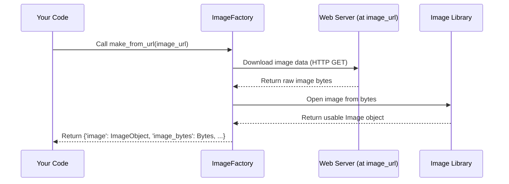

# Chapter 2: Media Handling (Types & Factory)

Welcome back! In [Chapter 1: Configuration System](01_configuration_system_.md), we learned how Feluda uses a `config.yml` file as a blueprint to get its instructions. Now, let's talk about one of the main things Feluda works with: **media**.

**What's the Big Deal with Media?**

Feluda is designed to process different kinds of media – think text documents, images found online, videos stored on your computer, or audio clips. A core task might be: "Take this image from a website link and tell me what's in it."

But here's the challenge: media can come from many places and in different forms:

*   An image might be specified by a **URL** (like `https://example.com/image.jpg`).
*   A video might be a **local file path** on your computer (like `C:\MyVideos\cat_video.mp4`).
*   Text might already be loaded **in your program's memory**.

The different tools within Feluda (which we'll call [Operators](03_operators_.md) in the next chapter) need a simple, consistent way to get this media data, no matter where it originally came from. They shouldn't have to worry about *how* to download a file from a URL or *how* to read an image file from the disk every single time.

That's where **Media Handling** in Feluda comes in. It provides a standard way to:

1.  **Identify** the type of media (Is it text, image, video, or audio?).
2.  **Fetch** the actual media data from its source (URL, file path, etc.).
3.  **Prepare** it in a usable format for the processing tools.

**Key Idea 1: Knowing the Type - `MediaType`**

First, Feluda needs a simple way to label the *kind* of media we're dealing with. Is it a picture? A sound clip? Just plain text? For this, Feluda uses something called an **Enum** (short for Enumeration) named `MediaType`.

Think of an Enum like a set of predefined labels or tags. `MediaType` defines the official tags Feluda understands:

```python
# Simplified from feluda/models/media.py

from enum import Enum

class MediaType(Enum):
    UNSUPPORTED = "unsupported" # If it's none of the below
    TEXT = "text"              # For text data
    IMAGE = "image"            # For images
    VIDEO = "video"            # For videos
    AUDIO = "audio"            # For audio clips
```

*   This code defines the `MediaType` labels. If Feluda is told it's working with an `IMAGE`, it knows to expect picture data.

**Key Idea 2: Getting the Data - `MediaFactory`**

Okay, we know *what* type of media it is (e.g., `MediaType.IMAGE`). But how do we get the actual image data if we only have a URL like `https://example.com/cat.jpg` or a file path like `/home/user/pictures/dog.png`?

This is the job of the **MediaFactory**. Think of it like a specialized workshop that knows how to handle different media types and sources.

*   If you give it `MediaType.IMAGE` and a URL, it knows how to **download** the image from the web.
*   If you give it `MediaType.IMAGE` and a local file path, it knows how to **read** the image file from your disk.
*   If you give it `MediaType.VIDEO` and a URL, it knows how to **download** the video file (often saving it temporarily to disk).
*   ...and so on for other types and sources (like data already in memory).

Feluda has specific "Factory" classes for each media type (like `ImageFactory`, `VideoFactory`, etc.). These factories contain the logic for fetching and preparing the data.

**How it Works: An Example**

Let's revisit our use case: "Take this image from a website link and prepare it for analysis."

1.  **Input:** You have the URL `https://some-site.com/funny_cat.png`.
2.  **Identify Type:** You know this is an image, so you'd use `MediaType.IMAGE`.
3.  **Use the Factory:** You'd use the `ImageFactory`'s method designed for URLs.

Here's a simplified conceptual Python snippet showing how you might use it:

```python
# --- This is a conceptual example, not exact Feluda code ---
from feluda.models.media import MediaType # Import the labels
from feluda.models.media_factory import ImageFactory # Import the image workshop

# Our input
image_url = "https://some-site.com/funny_cat.png"
media_type = MediaType.IMAGE # We know it's an image

# Ask the ImageFactory to get the image from the URL
print(f"Trying to get image from: {image_url}")

# The factory handles the download and preparation
# (Actual method name might differ slightly, e.g., make_from_url)
image_data = ImageFactory.make_from_url(image_url)

# What do we get back?
# image_data might be a dictionary containing:
# - The image loaded into a usable object (like a PIL Image)
# - The raw image data as bytes
# - Sometimes, a path to a temporarily downloaded file

if image_data:
    print("Success! Got the image data.")
    # Now, an Operator could use image_data['image'] or image_data['image_bytes']
else:
    print("Failed to get the image.")

# --- End conceptual example ---
```

*   We import the necessary `MediaType` and `ImageFactory`.
*   We call a method on `ImageFactory` specifically designed to handle URLs (`make_from_url`).
*   The factory does the heavy lifting (downloading, opening the image).
*   It returns the prepared image data (often in a dictionary) ready for the next step (like analysis by an [Operator](03_operators_.md)).

The key benefit? The code *using* the factory doesn't need to know the details of downloading files or handling different image formats. It just asks the factory!

**Under the Hood: How the Factory Works**

Let's peek inside the workshop. What happens when you call `ImageFactory.make_from_url(image_url)`?

1.  **Receive Request:** The `ImageFactory` gets the `image_url`.
2.  **Fetch Data:** It uses a standard Python library (like `requests`) to send an HTTP GET request to the `image_url`. The web server sends back the image data.
3.  **Handle Data:** The factory receives the raw image data (bytes).
4.  **Prepare Data:** It uses another library (like `PIL` - Python Imaging Library) to interpret these bytes as an image, creating an actual Image object that programs can easily work with. It might also keep the raw bytes.
5.  **Return Result:** It packages the prepared data (the Image object, the bytes) into a dictionary and returns it.

Here's a simple diagram showing this flow:



**Diving into the Code (Simplified)**

Let's look at snippets from the actual Feluda codebase.

First, the `MediaType` enum we saw earlier (`feluda/models/media.py`):

```python
# From feluda/models/media.py
from enum import Enum

class MediaType(Enum):
    UNSUPPORTED = "unsupported"
    TEXT = "text"
    IMAGE = "image"
    VIDEO = "video"
    AUDIO = "audio"
    # ... (a helper method 'make' might also be present)
```

*   This defines the standard labels Feluda uses internally.

Now, a simplified look at the `ImageFactory` (`feluda/models/media_factory.py`):

```python
# Simplified from feluda/models/media_factory.py
import requests # To download from URLs
from io import BytesIO # To handle raw bytes
import PIL # To work with image objects
# ... other imports like numpy might be used ...

class ImageFactory:
    @staticmethod # Means you call it directly on the class (ImageFactory.make_from_url)
    def make_from_url(image_url):
        try:
            # 1. Download the image content from the URL
            resp = requests.get(image_url)
            image_bytes = resp.content # Get the raw bytes

            # 2. Open the bytes as an image using PIL
            image = PIL.Image.open(BytesIO(image_bytes))

            # (Might also convert to other formats like NumPy array)
            # image_array = np.array(image)

            # 3. Return the prepared data in a dictionary
            return {
                "image": image,         # The PIL Image object
                # "image_array": image_array, # Optional NumPy array
                "image_bytes": image_bytes, # The raw bytes
            }
        except Exception as e:
            print(f"Error fetching image from URL {image_url}: {e}")
            return None # Return nothing on failure
```

*   This `make_from_url` method takes a URL.
*   It uses `requests.get` to download the data.
*   It uses `PIL.Image.open` (reading from `BytesIO` which treats bytes like a file) to create a usable `image` object.
*   It returns a dictionary containing the `image` object and the original `image_bytes`.

Feluda also has similar methods like `make_from_file_on_disk` (which would use `open(file_path, 'rb')` to read local files) and corresponding factories (`VideoFactory`, `AudioFactory`, `TextFactory`) that handle the specifics of those media types (e.g., potentially downloading videos/audio to temporary files using `wget` or handling S3 URLs).

Finally, Feluda often uses a central dictionary to easily select the correct factory based on the `MediaType`:

```python
# Simplified from feluda/models/media_factory.py
# ... import ImageFactory, TextFactory, VideoFactory, AudioFactory ...
from feluda.models.media import MediaType

# A mapping from the media type label to the correct factory class
media_factory = {
    MediaType.TEXT: TextFactory,
    MediaType.IMAGE: ImageFactory,
    MediaType.VIDEO: VideoFactory,
    MediaType.AUDIO: AudioFactory,
}

# How it might be used elsewhere:
# chosen_factory = media_factory[MediaType.IMAGE]
# image_data = chosen_factory.make_from_url(some_url)
```

*   This dictionary acts like a lookup table. If you know you have an `IMAGE`, you can quickly get the `ImageFactory` to handle it.

**Conclusion**

Media Handling in Feluda, through `MediaType` and the `MediaFactory` classes, solves the crucial problem of dealing with different kinds of media coming from different sources.

*   **`MediaType`** provides simple labels (Text, Image, Video, Audio).
*   **`MediaFactory`** acts as a universal adapter, hiding the complexity of fetching (downloading from URLs, reading local files, accessing S3) and preparing media data.

This ensures that the tools performing the actual analysis (the [Operators](03_operators_.md)) can receive media in a consistent, ready-to-use format, making the whole system more modular and easier to manage.

Now that we know how Feluda gets its media ready, let's dive into the tools that actually *do* things with this media.

Next up: [Chapter 3: Operators](03_operators_.md).

---

Generated by [AI Codebase Knowledge Builder](https://github.com/The-Pocket/Tutorial-Codebase-Knowledge)