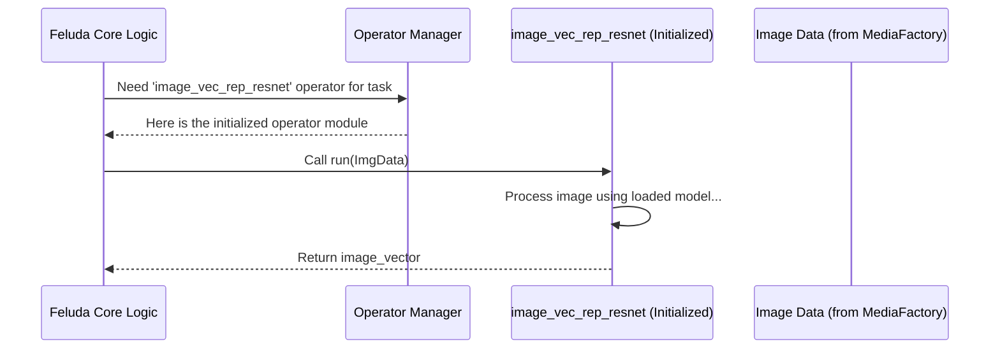

# Chapter 3: Operators

Welcome back! In [Chapter 2: Media Handling (Types & Factory)](02_media_handling__types___factory__.md), we learned how Feluda prepares different kinds of media (like images or videos) from various sources (like URLs or local files) into a standard format.

Now, what do we *do* with this prepared media? Maybe we want to figure out what's in an image, find similar videos, or extract text from a picture. This is where **Operators** come in!

**What Problem Do Operators Solve?**

Imagine you have a toolbox filled with specialized tools: a hammer for nails, a screwdriver for screws, a saw for cutting wood. Each tool does one specific job really well.

Feluda needs similar specialized tools for data processing tasks. Instead of writing one giant program that tries to do everything, Feluda uses **Operators** – small, independent modules designed for specific jobs.

For example, you might need a tool that:

*   Looks at an image and generates a "vector representation" (a list of numbers describing the image's content).
*   Takes a video and extracts keyframes.
*   Detects text within an image.
*   Groups similar items together based on their vector representations (clustering).

Operators are Feluda's specialized tools in the toolbox.

**The Central Idea: Pluggable Tools**

Think of an Operator as a plug-and-play component. You can easily add new Operators to Feluda to give it new capabilities, or choose which ones to use for a particular task based on your needs (configured in the [Configuration System](01_configuration_system_.md)).

**How Operators Work: Initialize and Run**

Most operators in Feluda follow a simple pattern. They usually have two main functions:

1.  **`initialize(parameters)`:** This function runs once when Feluda starts up (if the operator is enabled in the configuration). Its job is to get the tool ready. This might involve:
    *   Loading a machine learning model into memory (like loading a pre-trained image recognition model).
    *   Setting up connections to external resources.
    *   Reading any specific settings needed by the operator (passed in `parameters`).
    *   Analogy: Before you start building furniture, you might need to unpack your tools, charge the drill's battery, or lay out the screws. `initialize` is like that preparation step.

2.  **`run(input_data)`:** This is the function that does the actual work! It takes the prepared input data (like the image object we got from the [Media Handling (Types & Factory)](02_media_handling__types___factory__.md)) and performs the specific task the operator is designed for. It then returns the result.
    *   Analogy: This is like actually using the drill to put in a screw or using the saw to cut wood. `run` performs the action.

**Example Use Case: Getting an Image Vector**

Let's say our goal is to take an image and get a vector representation (a list of numbers that mathematically summarizes the image content, useful for finding similar images).

1.  **Get Media:** Feluda uses the `ImageFactory` (from [Media Handling (Types & Factory)](02_media_handling__types___factory__.md)) to get the image data, maybe from a URL. This gives us a dictionary like `{'image': <PIL.Image object>, 'image_bytes': <raw_bytes>}`.
2.  **Choose Operator:** Feluda knows (from the configuration) that we want to use an image vector operator, for example, one called `image_vec_rep_resnet`.
3.  **Initialize (Happens at Startup):** When Feluda started, it already called the `initialize()` function for `image_vec_rep_resnet`. This function loaded a pre-trained ResNet model (a popular image recognition model) into memory.
4.  **Run:** Feluda calls the `run()` function of the `image_vec_rep_resnet` operator, passing it the image data dictionary.
5.  **Process:** The `run()` function takes the `<PIL.Image object>` from the input dictionary, processes it using the loaded ResNet model, and generates a vector (a list of numbers, maybe 512 numbers long).
6.  **Result:** The `run()` function returns this list of numbers.

**A Look at an Example Operator: `image_vec_rep_resnet`**

Let's peek at a simplified version of the code for an operator that generates image vectors using ResNet. This code lives in files like `operators/image_vec_rep_resnet/image_vec_rep_resnet.py` or `src/core/operators/image_vec_rep_resnet.py`.

First, the `initialize` function:

```python
# Simplified from operators/image_vec_rep_resnet/image_vec_rep_resnet.py

# (Import necessary libraries like torch, torchvision)
import torchvision.models as models

class ResNet18:
    # ... (Code to load and prepare the model) ...
    def __init__(self):
        print("Initializing ResNet model...")
        # Load the pre-trained ResNet18 model
        self.model = models.resnet18(weights=models.ResNet18_Weights.DEFAULT)
        # Prepare the model for feature extraction
        self.feature_layer = self.model._modules.get("avgpool")
        self.model.eval() # Set model to evaluation mode
    # ... (Method to extract features) ...

# Global variable to hold the initialized model instance
resnet18 = None

def initialize(param):
    """Gets called once at startup to prepare the operator."""
    global resnet18
    # Create an instance of our ResNet class (which loads the model)
    resnet18 = ResNet18()
    print("ResNet operator initialized.")

```

*   This `initialize` function creates an instance of a `ResNet18` class.
*   Inside `ResNet18.__init__`, the actual machine learning model (`models.resnet18`) is downloaded (if needed) and loaded into memory. This might take a few seconds, which is why it's done once at the start, not every time an image is processed.

Now, the `run` function:

```python
# Simplified from operators/image_vec_rep_resnet/image_vec_rep_resnet.py

# (Import necessary libraries like numpy)
# (Include the ResNet18 class definition from above)

def run(image_obj):
    """Gets called to process an image and return its vector."""
    print("Running ResNet operator...")
    # 1. Get the image object from the input dictionary
    #    (This dictionary comes from the MediaFactory)
    image = image_obj["image"]

    # 2. Ensure image is in the correct format (RGB)
    image = image.convert("RGB")

    # 3. Use the initialized model (resnet18) to extract the vector
    #    (The actual feature extraction logic is inside the ResNet18 class)
    image_vec = resnet18.extract_feature(image) # extract_feature is a method in ResNet18

    # 4. Return the resulting vector (a list/array of numbers)
    print(f"Generated vector of size: {len(image_vec)}")
    return image_vec

```

*   This `run` function takes the `image_obj` dictionary (output from `ImageFactory`) as input.
*   It pulls out the actual image data (`image_obj["image"]`).
*   It calls the `extract_feature` method on the `resnet18` object (which was created during `initialize`) to do the calculation.
*   It returns the `image_vec`, which is typically a NumPy array or list of floating-point numbers.

**Example Input and Output for `run`:**

*   **Input (`image_obj`)**: `{'image': <PIL.Image object representing a cat>, 'image_bytes': b'\x89PNG...'}`
*   **Output (`image_vec`)**: `[0.123, -0.456, 0.789, ..., -0.012]` (A list or array of 512 numbers)

**How Feluda Knows Which Operators to Use**

Feluda doesn't magically know about every operator. You tell it which ones to activate using the `config.yml` file we discussed in [Chapter 1: Configuration System](01_configuration_system_.md).

A snippet in your `config.yml` might look like this:

```yaml
# config.yml (Snippet)

operators:
  label: 'default_processing_tools'
  parameters:
    - type: 'operators.image_vec_rep_resnet.image_vec_rep_resnet' # Path to the operator code
      parameters: {} # Optional parameters for initialize()
    - type: 'operators.cluster_embeddings.cluster_embeddings'
      parameters: {}
    # Add other operators you want to use...
```

*   This tells Feluda to activate two operators: one for image vectors (`image_vec_rep_resnet`) and one for clustering (`cluster_embeddings`).
*   The `type` usually points to the Python module where the operator's `initialize` and `run` functions are defined.

**Under the Hood: Loading and Running Operators**

When Feluda starts, a part of it acts like an "Operator Manager". Let's see the steps:

1.  **Read Config:** The Operator Manager reads the `operators` section of your `config.yml`.
2.  **Find Code:** For each operator listed (like `operators.image_vec_rep_resnet.image_vec_resnet`), it uses Python's `importlib` library to dynamically find and load the corresponding Python code file.
3.  **Initialize:** It calls the `initialize()` function found in that file, passing any specific `parameters` from the config. This prepares the operator (e.g., loads the ResNet model). It stores a reference to the loaded, initialized operator module.
4.  **Wait for Tasks:** The operators are now ready and waiting.
5.  **Task Arrives:** Later, when a task requires, say, image vectorization, Feluda tells the Operator Manager: "I need the `image_vec_rep_resnet` operator."
6.  **Get Operator:** The Manager retrieves the reference to the already initialized operator module.
7.  **Execute `run`:** Feluda calls the `run()` function of that operator, passing the necessary input data (the image object).
8.  **Return Result:** The operator's `run()` function executes and returns the result (the image vector) back to Feluda.

Here's a simplified diagram of steps 5-8:



**Diving Deeper into the Code (Operator Manager)**

The Operator Manager logic might reside in a class (like `Operator` in `feluda/operator.py` or `src/core/operators/__init__.py`). Here's a simplified look:

```python
# Simplified from feluda/operator.py or src/core/operators/__init__.py
import importlib # Used to load code dynamically
import logging

log = logging.getLogger(__name__)

class OperatorManager: # Renamed for clarity
    def __init__(self, operator_configs):
        # Stores {'operator_type_name': initialized_module}
        self.active_operators = {}
        self.operator_configs = operator_configs # List of configs from YAML

    def setup(self):
        """Loads and initializes all configured operators."""
        log.info("Setting up operators...")
        for op_config in self.operator_configs:
            operator_type = op_config.type # e.g., 'operators.image_vec_rep_resnet...'
            params = op_config.parameters # Parameters for initialize()
            try:
                log.info(f"Loading operator: {operator_type}")
                # Dynamically import the Python module
                module = importlib.import_module(operator_type)

                # Call the operator's initialize function
                module.initialize(params)

                # Store the initialized module for later use
                self.active_operators[operator_type] = module
                log.info(f"Successfully initialized: {operator_type}")
            except Exception as e:
                log.error(f"Failed to load/initialize {operator_type}: {e}")

    def get_operator(self, operator_type):
        """Returns the initialized operator module."""
        return self.active_operators.get(operator_type)

# How Feluda might use it:
# config = load("config.yml") # From Chapter 1
# operator_manager = OperatorManager(config.operators.parameters)
# operator_manager.setup() # Calls initialize() on all operators

# Later, when needed:
# img_vec_op = operator_manager.get_operator('operators.image_vec_rep_resnet...')
# if img_vec_op:
#   result = img_vec_op.run(image_data)
```

*   The `setup` method loops through the operator configurations from the YAML file.
*   `importlib.import_module(operator_type)` dynamically loads the Python code for the operator.
*   `module.initialize(params)` calls the setup function within that operator's code.
*   The loaded and initialized `module` is stored in the `active_operators` dictionary.
*   The `get_operator` method allows other parts of Feluda to easily retrieve an initialized operator when needed.

**Variety of Operators**

Feluda comes with several built-in operators, and you can create your own. Besides `image_vec_rep_resnet`, the provided code includes examples like:

*   `cluster_embeddings`: Takes multiple vector representations and groups similar ones together.
*   `dimension_reduction`: Reduces the complexity of high-dimensional vectors (like image vectors) for visualization (e.g., using t-SNE).
*   `vid_vec_rep_clip` / `vid_vec_rep_resnet`: Generate vector representations for videos or keyframes within videos.
*   `audio_vec_embedding`: Generate vector representations for audio clips.

Each follows the same basic `initialize`/`run` pattern, acting as a specialized tool for its task.

**Conclusion**

Operators are the workhorses of Feluda. They are modular, pluggable units that perform specific data processing tasks.

*   They follow a standard structure with an `initialize` function (for setup) and a `run` function (for execution).
*   Feluda discovers, loads, and initializes operators based on the [Configuration System](01_configuration_system_.md).
*   They take prepared input (often from [Media Handling (Types & Factory)](02_media_handling__types___factory__.md)) and produce results like vector representations, text detections, or cluster assignments.

Think of them as the specialized tools in Feluda's data processing toolbox. Now that we know how Feluda can process data using Operators, we need a way to store the original media information and the results of these operations. That's the job of Stores.

Ready to learn about storing data? Let's move on to [Chapter 4: Stores](04_stores_.md).

---

Generated by [AI Codebase Knowledge Builder](https://github.com/The-Pocket/Tutorial-Codebase-Knowledge)