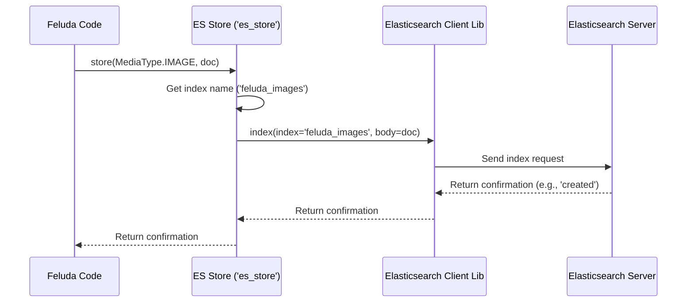

# Chapter 4: Stores

Welcome back! In [Chapter 3: Operators](03_operators_.md), we saw how Feluda uses specialized tools called Operators to process media – for example, generating a "vector" (a list of numbers) that represents an image.

That's great, but once we have this useful information (like the image vector and maybe some details about the image), where do we put it? If we just let it disappear when the program finishes, it's not very useful! We need a way to **save** this data so we can find it later, perhaps to search for similar images.

This is where **Stores** come in.

**What Problem Do Stores Solve?**

Imagine you've just written a fantastic book report (the result of your hard work, like the vector from an Operator). You don't want to lose it! You need a place to store it, like a filing cabinet or a specific shelf in a library.

Feluda needs a similar system for storing the data it processes, especially things like:

*   The vector representation of an image, video, or text.
*   Metadata associated with the media (like where it came from, when it was processed, or any detected text).

But here's a twist: just like there are different library systems (some use old card catalogs, some use modern computer databases), Feluda might need to store data in different kinds of databases or storage systems. Common examples include:

*   **Elasticsearch:** Great for searching text and vectors quickly.
*   **PostgreSQL:** A traditional relational database, sometimes used for metadata or simpler storage needs.

Feluda needs a way to talk to these different storage systems without needing to know the unique, complicated details of *how* each one works internally.

**The Solution: A Universal Librarian**

Think of a **Store** in Feluda as an expert librarian. This librarian knows how to interact with various library systems (Elasticsearch, PostgreSQL, etc.). You don't need to know the specific commands for each system; you just tell the librarian what you want to do:

*   "Please **store** this book report (our data)."
*   "Can you **find** book reports similar to this one (search using a vector)?"
*   "Let's **connect** to the library system."
*   "Could you **initialise** the filing system (set up the database tables or indices)?"

The Store provides a **common interface** (a standard set of commands like `connect`, `store`, `find`, `initialise`) that Feluda can use, regardless of the underlying storage system. It acts as an **abstraction** – hiding the complex details behind a simpler front.

**Key Concepts**

1.  **Abstraction:** Stores hide the specific details of *how* data is stored in Elasticsearch or PostgreSQL. Your main Feluda code doesn't need to change much if you switch from one database to another.
2.  **Common Interface:** All Store types aim to provide similar methods (like `connect`, `store`, `find`, `initialise`), making them interchangeable from Feluda's perspective.

**How to Use Stores**

Let's go back to our use case: We used an [Operator](03_operators_.md) to get an image vector and some metadata. Now we want to save it.

**1. Configuration**

First, we tell Feluda which storage system(s) to use in our `config.yml` file (remember [Chapter 1: Configuration System](01_configuration_system_.md)?).

```yaml
# config.yml (Snippet)

store:
  label: 'main_storage' # A name for this group of stores
  entities:
    - label: 'vector_db' # A specific name for this store instance
      type: 'es_vec'     # Tells Feluda to use the Elasticsearch vector store
      parameters:
        host_name: 'localhost:9200' # Where Elasticsearch is running
        image_index_name: 'feluda_images' # Name for the image data "table" in ES
        text_index_name: 'feluda_text'
        # ... other index names for video, audio ...
    # You could potentially add another store here, e.g., a PostgreSQL one
    # - label: 'metadata_db'
    #   type: 'postgresql'
    #   parameters:
    #     table_names: ['media_metadata']
    #     # ... other connection details ...
```

*   This configuration tells Feluda to set up an Elasticsearch vector store (`es_vec`) named `vector_db`.
*   It provides connection details (`host_name`) and specifies the names of the "indices" (like tables) where different media types will be stored (`image_index_name`, etc.).

**2. Getting the Store Ready**

When Feluda starts, it reads this configuration and creates the necessary Store objects. It might also call the `initialise()` method on the store, which can automatically set up the required database structures (like creating the `feluda_images` index in Elasticsearch if it doesn't exist).

```python
# Conceptual: How Feluda might get the store instance
# (This usually happens inside Feluda's core setup)

# 1. Load the config file (from Chapter 1)
# config = load_config("config.yml")

# 2. Get the specific store instance based on config
#    (Feluda has internal logic like `get_stores` shown later)
# es_store = get_store_instance(config.store, type='es_vec')

# 3. Connect to the database
# es_store.connect()

# 4. Ensure database structures are ready
# es_store.initialise() # Might create indices like 'feluda_images'

# Now es_store is ready to use!
```

**3. Storing Data**

Let's say our image Operator produced a result like this:

```python
# Example result from an image operator
operator_result = {
    "vec": [0.1, 0.9, -0.2, ...], # The image vector (list of numbers)
    "detected_text": "Hello World",
    "has_text": True,
    "lang": "en"
}

# Original info about the image
image_metadata = {
    "source_id": "image_001", # A unique ID for this image
    "source": "user_upload",
    "metadata": {"filename": "cat_pic.jpg"}
}
```

Now, we use the `store` method of our Elasticsearch Store instance (`es_store`). We often need an "adapter" function to format the operator result and metadata into the exact structure the specific store expects.

```python
# Simplified Conceptual Usage

from core.store.es_vec_adapter import image_rep_to_es_doc # Helper to format data
from core.models.media import MediaType # To specify the type

# 1. Format the data for Elasticsearch using an adapter
es_document = image_rep_to_es_doc(operator_result, image_metadata)
# es_document might look like:
# { 'e_kosh_id': 'image_001', 'image_vec': [0.1, ...], 'text': 'Hello World', ... }

# 2. Tell the store to save it
try:
    # We specify the type (IMAGE) so it uses the right index ('feluda_images')
    result = es_store.store(media_type=MediaType.IMAGE, doc=es_document)
    print("Store result:", result)
    # Output might be: {'_index': 'feluda_images', '_id': 'some_random_id', 'result': 'created', ...}
except Exception as e:
    print(f"Error storing data: {e}")

```

*   We import a helper function `image_rep_to_es_doc` to put our data in the right format.
*   We call `es_store.store()`, passing the `MediaType.IMAGE` and the formatted `es_document`.
*   The Store handles the communication with Elasticsearch to save the data.

**4. Finding Similar Data**

Later, maybe a user uploads a *new* image, and we want to find similar images already stored. We generate a vector for the new image using an [Operator](03_operators_.md).

```python
# Vector for the new image we want to search with
query_vector = [0.15, 0.85, -0.25, ...] # List of numbers
```

Now, we use the `find` method of our Store:

```python
# Simplified Conceptual Usage

try:
    # Ask the store to find similar images using the vector
    # We specify the index name where images are stored
    similar_items = es_store.find(index_name='feluda_images', vec=query_vector)
    print("Found similar items:")
    for item in similar_items:
        print(f" - ID: {item['e_kosh_id']}, Score: {item['dist']}")
    # Output might be:
    # Found similar items:
    #  - ID: image_001, Score: 0.987
    #  - ID: image_056, Score: 0.954
    #  ... (List of similar items, often ranked by similarity score 'dist')
except Exception as e:
    print(f"Error finding data: {e}")
```

*   We call `es_store.find()`, passing the name of the index (`feluda_images`) and the `query_vector`.
*   The Store constructs the appropriate search query for Elasticsearch (using vector similarity).
*   It returns a list of documents found, often sorted by how similar they are to the query vector.

**Under the Hood: How Does the Librarian Work?**

Let's imagine what happens when you ask the Elasticsearch "librarian" (`ES` store) to `store` some image data.

1.  **Receive Request:** Feluda calls `es_store.store(MediaType.IMAGE, es_document)`.
2.  **Identify Index:** The Store uses `MediaType.IMAGE` to look up the correct Elasticsearch index name (e.g., `feluda_images`) from its configuration.
3.  **Format (Implicit):** The data (`es_document`) should already be in a format Elasticsearch understands (often a Python dictionary that maps easily to JSON).
4.  **Send to Database:** The Store uses the underlying Elasticsearch client library to send an "index" command to the Elasticsearch server, specifying the index name (`feluda_images`) and the data (`es_document`).
5.  **Get Response:** Elasticsearch saves the data and sends back a confirmation (like `{'result': 'created'}`).
6.  **Return Result:** The Store returns this confirmation back to Feluda.

Here’s a diagram showing the `store` process:



Similarly, when `find(index_name='feluda_images', vec=query_vector)` is called:

1.  **Receive Request:** Feluda calls `find` with the index name and vector.
2.  **Build Query:** The Store constructs a specific Elasticsearch query. This query tells Elasticsearch: "Find documents in the `feluda_images` index, and rank them based on how close their `image_vec` field is to the `query_vector` I'm providing." (This often uses specialized vector search functions like `l2norm` or `cosineSimilarity`).
3.  **Send Query:** The Store uses the Elasticsearch client library to send this search query to the server.
4.  **Get Results:** Elasticsearch performs the search and sends back a list of matching documents, ranked by similarity.
5.  **Format Results:** The Store might format the raw Elasticsearch response into a cleaner list of dictionaries (like the one shown in the `find` example above).
6.  **Return Results:** The Store returns the formatted list of results to Feluda.

**Diving Deeper into the Code**

Let's look at simplified snippets from Feluda's Store implementation.

**1. Getting Store Instances (`src/core/store/__init__.py`)**

This file acts like a registry, mapping store types (like `'es_vec'`) to their corresponding Python classes (`es_vec.ES`).

```python
# Simplified from src/core/store/__init__.py
from core.config import StoreConfig
from . import es_vec # Import the Elasticsearch store code
from . import postgresql # Import the PostgreSQL store code

# Map type names (from config.yml) to the actual Store classes
stores = {
    "es_vec": es_vec.ES,
    "postgresql": postgresql.PostgreSQLManager
}

def get_stores(config: StoreConfig):
    """Creates instances of stores defined in the config."""
    stores_dict = {}
    # Loop through store configurations from config.yml
    for store_config_entity in config.entities:
        store_type = store_config_entity.type # e.g., 'es_vec'
        # Get the correct class (e.g., es_vec.ES) from the map
        StoreClass = stores[store_type]
        # Create an instance of the class, passing its specific config
        stores_dict[store_type] = StoreClass(store_config_entity)
    return stores_dict # Returns {'es_vec': <ES object>, ...}
```

*   The `stores` dictionary maps the `type` string from `config.yml` to the actual Python class that implements that store.
*   The `get_stores` function reads the configuration, looks up the right class for each configured store, and creates an instance of it, passing the specific parameters from the config.

**2. Elasticsearch Store Implementation (`src/core/store/es_vec.py`)**

This file contains the `ES` class, our Elasticsearch "librarian".

```python
# Simplified from src/core/store/es_vec.py
import logging
from core.models.media import MediaType
from core.config import StoreEntity # Dataclass for store config section
from elasticsearch import Elasticsearch # The official ES library
# import ... other helpers like mappings, adapter

log = logging.getLogger(__name__)

class ES: # The Elasticsearch Store implementation
    def __init__(self, config: StoreEntity):
        """Stores configuration when the object is created."""
        # Get connection details from environment or config
        self.es_host = config.parameters.host_name # e.g., 'localhost:9200'
        # Store the index names provided in the config
        self.indices = {
            "image": config.parameters.image_index_name, # e.g., 'feluda_images'
            "text": config.parameters.text_index_name,
            # ... video, audio ...
        }
        self.client = None # Elasticsearch client will be stored here

    def connect(self):
        """Establishes connection to the Elasticsearch server."""
        try:
            # Create the client object using the host details
            self.client = Elasticsearch([self.es_host])
            log.info("Success Connecting to Elasticsearch")
            # You might add a self.client.ping() here to verify
        except Exception:
            log.exception("Error Connecting to Elasticsearch")

    def initialise(self):
        """Checks if indices exist and creates them if not."""
        # (Simplified - actual code uses mappings from es_vec_mappings.py)
        log.info("Initialising Elasticsearch indices...")
        for media_type, index_name in self.indices.items():
            if not self.client.indices.exists(index=index_name):
                log.info(f"Creating index: {index_name}")
                # In reality, uses predefined 'mappings' for structure
                self.client.indices.create(index=index_name, body={}) # Simplified body
            else:
                log.info(f"Index {index_name} already exists.")

    def store(self, media_type: MediaType, doc):
        """Stores a single document in the correct index."""
        index_name = self.indices[media_type.value] # Get index name ('feluda_images')
        log.info(f"Storing document in index: {index_name}")
        # Use the client to index (save) the document
        result = self.client.index(index=index_name, body=doc)
        return result # Return Elasticsearch confirmation

    def find(self, index_name, vec):
        """Finds similar documents using vector search."""
        log.info(f"Finding similar vectors in index: {index_name}")
        # --- Simplified Query ---
        # Actual query is more complex, using script_score for vector distance
        query_body = {
            "query": {
                "script_score": { # Tells ES to rank by a script score
                    "query": {"match_all": {}}, # Consider all docs initially
                    "script": {
                        # Simplified: calculates similarity score
                        "source": "1 / (1 + l2norm(params.query_vector, doc['image_vec'].value))",
                        "params": {"query_vector": vec} # Pass the search vector
                    }
                }
            },
            "size": 10 # Return top 10 matches
        }
        # --- End Simplified Query ---

        resp = self.client.search(index=index_name, body=query_body)
        # (Actual code uses an adapter 'es_to_sanitized' to format results)
        return resp['hits']['hits'] # Return raw hits for simplicity here
```

*   `__init__`: Stores the configuration (host, index names).
*   `connect`: Creates the `Elasticsearch` client object to talk to the database.
*   `initialise`: Checks if the needed indices exist and creates them using predefined structures (defined in `es_vec_mappings.py`, which specifies fields like `image_vec` should be a `dense_vector` type).
*   `store`: Takes the media type and data, finds the right index name, and uses `self.client.index()` to save the data.
*   `find`: Takes an index name and a query vector, builds a specialized Elasticsearch query (`script_score` using `l2norm` for vector similarity), sends it using `self.client.search()`, and returns the results.

*Note:* There are also helper files like `es_vec_adapter.py` (containing functions like `image_rep_to_es_doc` to format data correctly before storing) and `es_vec_mappings.py` (defining the structure/schema for each Elasticsearch index).

**3. PostgreSQL Store Example (`src/core/store/postgresql.py`)**

Feluda also includes an example of a Store for PostgreSQL. We won't dive deep, but notice how it aims for a similar interface:

```python
# Simplified structure from src/core/store/postgresql.py
import psycopg2 # PostgreSQL library
from core.config import StoreEntity
# import ... os, load_dotenv ...

class PostgreSQLManager:
    def __init__(self, config: StoreEntity):
        """Stores configuration."""
        self.host = os.getenv("PG_HOST")
        # ... other connection details (db, user, pass) ...
        self.table_name = config.parameters.table_names[0] # e.g., 'user_inbox'
        self.conn = None
        self.cur = None

    def connect(self):
        """Connects to the PostgreSQL database."""
        # ... uses psycopg2.connect() ...
        print("Connected to PostgreSQL database!")

    def initialise(self):
        """Creates tables and triggers if they don't exist."""
        # ... executes SQL CREATE TABLE IF NOT EXISTS ...
        # ... executes SQL CREATE OR REPLACE FUNCTION/TRIGGER ...
        print(f"Table {self.table_name} initialised.")

    def store(self, value_column_value, worker_column_value):
        """Stores a row in the configured table."""
        # ... builds SQL INSERT INTO statement ...
        # ... uses self.cur.execute() ...
        print("Value stored successfully!")

    def find(self, some_criteria): # Note: Find might be different for SQL
        """Finds data based on some criteria (not vector search here)."""
        # ... builds SQL SELECT statement ...
        # ... uses self.cur.execute() and fetches results ...
        print("Finding data in PostgreSQL...")
        # (Implementation would depend on what needs finding)
        return []

    # ... other methods like update, delete, close_connection ...
```

*   Even though the underlying database and commands are different (SQL vs. Elasticsearch DSL), the `PostgreSQLManager` class provides methods like `connect`, `initialise`, and `store`, just like the `ES` class. This consistency makes it easier for Feluda to work with either. (The `find` method might have different parameters depending on what kind of search is needed in SQL).

**Conclusion**

Stores are Feluda's way of handling data persistence – saving and retrieving information like media metadata and vector embeddings.

*   They act as an **abstraction layer**, hiding the specific details of different databases (like Elasticsearch or PostgreSQL).
*   They provide a **common interface** (methods like `connect`, `initialise`, `store`, `find`) so Feluda can interact with them consistently.
*   You configure which stores to use in your `config.yml`.
*   They enable core functionalities like saving analysis results and searching for similar items using vectors.

Think of Stores as the reliable librarians who manage Feluda's knowledge base, allowing it to remember and recall information effectively, no matter which "library system" (database) is used behind the scenes.

Now that we know how Feluda processes media ([Operators](03_operators_.md)) and stores the results ([Stores](04_stores_.md)), how do we expose these capabilities to the outside world, perhaps through a web interface?

Let's explore that next in [Chapter 5: Server & Endpoints](05_server___endpoints_.md).

---

Generated by [AI Codebase Knowledge Builder](https://github.com/The-Pocket/Tutorial-Codebase-Knowledge)