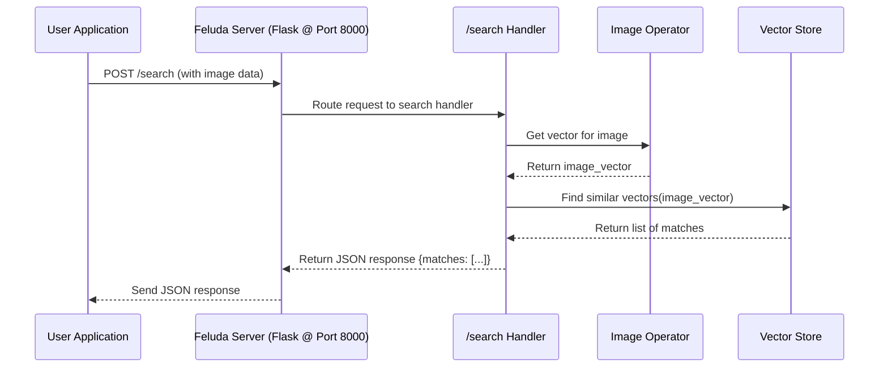

# Chapter 5: Server & Endpoints

Welcome back! In [Chapter 4: Stores](04_stores_.md), we learned how Feluda saves the results of its work, like image vectors or text analysis, into databases using Stores. But how do we actually *tell* Feluda to do something in the first place? How does a user or another application ask Feluda to, say, "index this new image" or "find images similar to this one"?

We need a way for the outside world to communicate with Feluda. This is where the **Server & Endpoints** come in.

**What Problem Does This Solve? The Front Desk**

Imagine Feluda is a large, busy library filled with librarians ([Stores](04_stores_.md)) and specialized researchers ([Operators](03_operators_.md)). If you just walked into the middle of the library and started shouting requests, it would be chaos!

You need a **front desk** or a **reception area**. This front desk:

1.  Listens for incoming requests (like someone walking up to the desk).
2.  Understands what the request is for (e.g., "I want to check in a new book" or "I need help finding books on cats").
3.  Directs the request to the right person or department inside the library.

Feluda's **Server** is like the front desk building itself – it's always open and listening for requests coming over the network (specifically, using the standard web language called HTTP).

**Endpoints** are like the specific service windows or counters at the front desk. Each window is labelled for a particular task:

*   One window might be labelled `/index` (for adding new items to Feluda).
*   Another window might be `/search` (for finding items).
*   Maybe a simple `/health` window just tells you if the library is open and running smoothly.

When a request arrives at the server, it looks at the "address" (the URL path, like `/search`) and the "method" (like `POST`, which usually means sending data) to figure out which window (Endpoint) should handle it.

**Key Concepts Explained**

1.  **Server:** The main program that runs continuously, listening for network requests on a specific port (like port 8000 on your computer). Feluda uses a popular Python library called **Flask** to create this server. It's the core listener.
2.  **Endpoint:** A specific path (like `/index` or `/search`) combined with an HTTP method (like `GET` for retrieving info or `POST` for sending data) that defines a particular action Feluda can perform. It's a specific "service window".
3.  **Handler Function:** The actual piece of Python code that gets executed when a request hits a specific endpoint. This function receives the request details (like data sent by the user), interacts with other Feluda parts (like [Operators](03_operators_.md) or [Stores](04_stores_.md)), and prepares a response to send back. It's the "person" working behind the service window.

**How to Use It: Talking to Feluda**

Let's say Feluda is running, and its server is listening on port 8000. How would you ask it to index an image?

You (or another application) would send an HTTP `POST` request to the address `http://localhost:8000/index`. This request would typically include:

*   **The URL:** `http://localhost:8000/index` (Server address + Endpoint path)
*   **The Method:** `POST` (Because we are sending data to be added)
*   **The Data:** Information about the image, often sent in the request body. This could be JSON data describing the image URL, or it could be the image file itself sent as "multipart/form-data".

**Example 1: Indexing an Image**

Imagine you want to index an image located at `https://example.com/cat.jpg`. You might send a `POST` request to `/index` with JSON data like this:

```json
// Request Body (sent to POST /index)
{
  "config": { "mode": "STORE" }, // Tell Feluda to process & store directly
  "post": {
    "id": "image_cat_001",        // Your unique ID for this image
    "media_type": "image",
    "media_url": "https://example.com/cat.jpg"
  },
  "metadata": { "source": "web" }
}
```

*   Feluda's server receives this request at the `/index` endpoint.
*   The handler function for `/index` gets this JSON data.
*   It uses the [Media Handling (Types & Factory)](02_media_handling__types___factory__.md) to fetch the image from the URL.
*   It calls an image [Operator](03_operators_.md) to generate a vector.
*   It uses a [Store](04_stores_.md) to save the vector and metadata.
*   It sends back a response, maybe like:

```json
// Response Body (sent back from Feluda)
{
  "message": "ok",
  "data": "some_internal_id_from_store" // Confirmation
}
```

**Example 2: Searching for Similar Images**

Now, let's say you have a local image file (`my_dog.jpg`) and you want to find similar images stored in Feluda. You'd send a `POST` request to `/search`, but this time you'd likely use `multipart/form-data` to upload the actual image file along with some JSON instructions:

*   **URL:** `http://localhost:8000/search`
*   **Method:** `POST`
*   **Data:**
    *   A JSON part describing the request: `{"query_type": "image"}`
    *   A file part containing the `my_dog.jpg` image data.

*   The `/search` endpoint handler receives this.
*   It uses the [Media Handling (Types & Factory)](02_media_handling__types___factory__.md) to process the uploaded file.
*   It calls an image [Operator](03_operators_.md) to get the vector for `my_dog.jpg`.
*   It uses a [Store](04_stores_.md) to `find` images with similar vectors in the database.
*   It sends back a response like:

```json
// Response Body (sent back from Feluda)
{
  "matches": [
    { "e_kosh_id": "image_cat_001", "dist": 0.95, ... }, // Similarity score
    { "e_kosh_id": "image_dog_012", "dist": 0.88, ... },
    // ... other similar items found
  ]
}
```

**Under the Hood: How the Server and Endpoints Work**

Let's peek behind the front desk. How does Feluda set this up?

**1. Creating the Server (`src/core/server.py`)**

Feluda uses a class, maybe called `Server`, to manage the Flask application.

```python
# Simplified from src/core/server.py
import logging
from flask import Flask # The web framework library
from flask_cors import CORS # For allowing web pages to connect

log = logging.getLogger(__name__)

class Server:
    def __init__(self, param): # param comes from config.yml
        self.param = param
        # Create the main Flask application object
        self.app = Flask(__name__)
        # Allow requests from web pages hosted on different domains
        CORS(self.app)
        self.endpoints = [] # List to hold configured endpoints

    def add_endpoint(self, endpoint_object):
        """Adds an endpoint definition to our list."""
        self.endpoints.append(endpoint_object)

    def enable_endpoints(self):
        """Connects endpoint paths/methods to handler functions."""
        log.info("Setting up routes...")
        for endpoint in self.endpoints:
            routes = endpoint.get_routes() # Ask endpoint for its paths/methods
            handler_factory = endpoint.get_handler # Ask endpoint for its handler logic
            try:
                for route_info in routes:
                    path, name, methods = route_info # e.g., ('/search', 'search', ['POST'])
                    # Tell Flask: "When a request comes for 'path' with 'methods', call 'handler_factory'"
                    self.app.add_url_rule(path, name, handler_factory, methods=methods)
                    log.info(f"Registered route: {methods} {path} -> {name}")
            except Exception:
                log.exception("Could not add route")

    def start(self):
        """Starts the Flask server to listen for requests."""
        # Add a simple default route
        @self.app.route("/")
        def hello_world():
            return "<p>Hello, Feluda is running!</p>"

        log.info(f"Starting server on port {self.param.parameters.port}")
        try:
            # Run the Flask development server
            self.app.run(host='0.0.0.0', port=self.param.parameters.port)
        except Exception:
            log.exception("Failed to start server")

```

*   `__init__`: Creates the main `Flask` app object. `CORS` helps if you're building a web frontend.
*   `add_endpoint`: Collects all the endpoint definitions (like `IndexEndpoint`, `SearchEndpoint`).
*   `enable_endpoints`: This is key! It loops through the collected endpoints. For each one, it gets the routes (like `/search` with `POST`) and the handler function. It then uses `self.app.add_url_rule` to tell Flask how to connect incoming requests to the correct code.
*   `start`: Runs the actual Flask web server, making it listen for connections on the configured port.

**2. Defining an Endpoint (`src/endpoint/search.py`)**

Each endpoint (like search or index) is often defined in its own class.

```python
# Simplified from src/endpoint/search.py
from core.feluda import Feluda
from .handler import SearchHandler # Import the class containing the logic

class SearchEndpoint:
    def __init__(self, feluda: Feluda):
        # Store a reference to the main Feluda object to access operators/stores
        self.feluda = feluda

    def get_routes(self):
        """Defines the paths and methods for this endpoint."""
        # Returns a list of tuples: (path, internal_name, methods_list)
        return [
            ("/search", "search", ["POST"]) # Handle POST requests to /search
        ]

    def get_handler(self):
        """Returns the function Flask should call for requests to /search."""
        # Create an instance of the handler class
        handler = SearchHandler(self.feluda)
        # Return the method that routes the request based on path (or just the main handler method)
        return handler.make_handlers # Or directly handler.handle_search if only one path
```

*   `__init__`: Often takes the main `Feluda` object so the handler can access other components like [Operators](03_operators_.md) and [Stores](04_stores_.md).
*   `get_routes`: Specifies the URL path (`/search`) and HTTP method (`POST`) this endpoint handles.
*   `get_handler`: Creates and returns the actual handler object or function that contains the logic to process the search request.

**3. Handling the Request (`src/endpoint/search.py`)**

The handler class contains the logic for a specific endpoint.

```python
# Simplified from src/endpoint/search.py (inside handler.py usually)
from flask import request # Flask's way to access incoming request data
import json
from core.models.media import MediaType
from core.models.media_factory import media_factory
# ... other imports

class SearchHandler:
    def __init__(self, feluda: Feluda):
        self.feluda = feluda # Get access to operators, stores

    def handle_search(self):
        """Processes an incoming search request."""
        try:
            # Check if data came as multipart (e.g., file upload)
            if "multipart/form-data" in request.content_type:
                data = json.loads(request.form.get("data")) # Get the JSON part
                if data["query_type"] == "image":
                    file = request.files["media"] # Get the uploaded file
                    # 1. Prepare media (using MediaFactory)
                    image_obj = media_factory[MediaType.IMAGE].make_from_file_in_memory(file)
                    # 2. Process with Operator
                    operators = self.feluda.operators.active_operators
                    image_vec = operators["image_vec_rep_resnet"].run(image_obj)
                    # 3. Query the Store
                    results = self.feluda.store["es_vec"].find("image", image_vec)
                    return {"matches": results} # 4. Send response
                # ... handle video search similarly ...
                else:
                    return {"message": "Unsupported multipart query type"}, 400
            # Check if data came as JSON
            elif request.content_type == "application/json":
                # ... handle text search or raw queries from JSON payload ...
                payload = request.get_json()
                if payload["query_type"] == "text":
                     results = self.feluda.store["es_vec"].find_text(payload["text"])
                     return {"matches": results}
                else:
                     return {"message": "Unsupported JSON query type"}, 400
            else:
                return "Unsupported content type", 400
        except Exception as e:
            log.exception("Error handling search request:", e)
            return "Failed to process search request", 500

    def make_handlers(self):
        """Chooses the right handler based on the exact path (if needed)."""
        # This might be simple if only one path like /search exists
        if request.path == "/search":
            return self.handle_search()
        else:
            # Should not happen if routing is correct
            return "Unknown search endpoint path", 404
```

*   The `handle_search` function uses `request` (from Flask) to access the incoming data (`request.files`, `request.form`, `request.get_json`).
*   It checks the type of request (image search, text search).
*   Crucially, it calls the other Feluda components:
    *   `media_factory` ([Media Handling (Types & Factory)](02_media_handling__types___factory__.md)) to prepare the input media.
    *   `self.feluda.operators` ([Operators](03_operators_.md)) to get vectors or analyze text.
    *   `self.feluda.store` ([Stores](04_stores_.md)) to query the database.
*   Finally, it returns the result, which Flask sends back to the user.

**Request Flow Diagram**

Here's a simplified view of what happens when a user sends a search request:



This shows how the server acts as the entry point, routing the request to the correct endpoint handler, which then coordinates the work using Feluda's other core components.

**Conclusion**

The **Server & Endpoints** provide the essential "front door" for Feluda.

*   The **Server** (using Flask) listens for incoming HTTP requests.
*   **Endpoints** (like `/index`, `/search`) define specific actions accessible via unique URL paths and methods.
*   **Handler functions** connect these endpoints to Feluda's internal logic, processing requests by using [Operators](03_operators_.md), [Stores](04_stores_.md), and [Media Handling (Types & Factory)](02_media_handling__types___factory__.md).

This structure makes Feluda accessible over the network, allowing users and applications to interact with its powerful media processing capabilities through a standard web API.

But how are all these components – Server, Endpoints, Operators, Stores, Media Handlers – tied together and managed? That's the role of the central coordinator.

Let's learn about the main manager class next: [Chapter 6: Feluda Class (Orchestrator)](06_feluda_class__orchestrator__.md).

---

Generated by [AI Codebase Knowledge Builder](https://github.com/The-Pocket/Tutorial-Codebase-Knowledge)