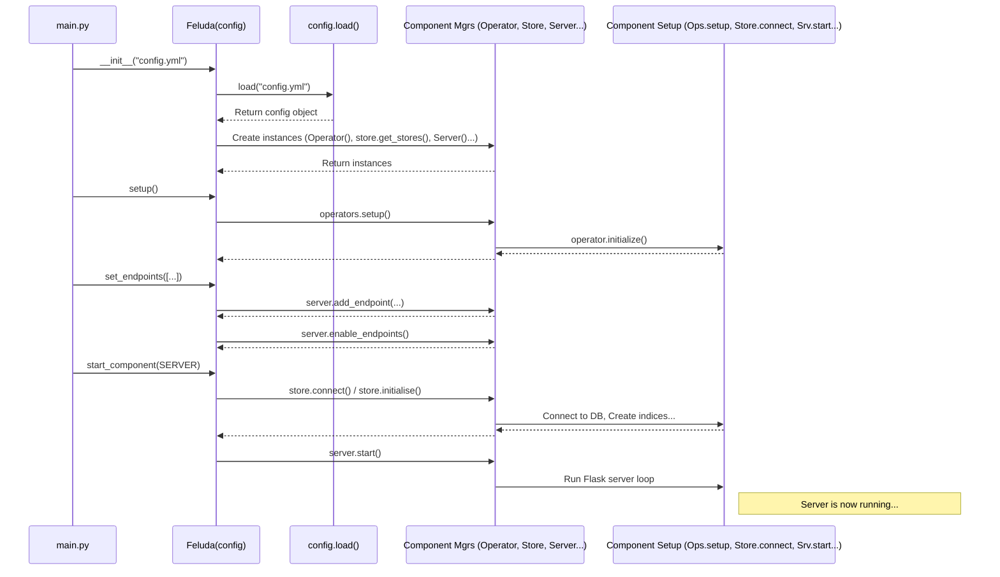

# Chapter 6: Feluda Class (Orchestrator)

Welcome back! In [Chapter 5: Server & Endpoints](05_server___endpoints_.md), we saw how Feluda creates a "front desk" (a web server) with specific service windows (endpoints) to handle requests from the outside world. We've now learned about several key pieces of Feluda:

*   The blueprint: [Configuration System](01_configuration_system_.md)
*   Handling input: [Media Handling (Types & Factory)](02_media_handling__types___factory__.md)
*   Doing the work: [Operators](03_operators_.md)
*   Saving results: [Stores](04_stores_.md)
*   Talking to the world: [Server & Endpoints](05_server___endpoints_.md)

But how do all these pieces get put together and managed? If you have a blueprint, different tools, storage cabinets, and a front desk, you need someone to make sure everything is built correctly, plugged in, and ready to run. That's the job of the **Feluda Class**.

**The Problem: Who's in Charge?**

Imagine building a complex machine. You have the instructions (`config.yml`), the engine ([Operators](03_operators_.md)), the fuel tank ([Stores](04_stores_.md)), and the dashboard ([Server & Endpoints](05_server___endpoints_.md)). Just having these parts isn't enough – you need a **chief engineer** or a **project manager** to:

1.  Read the instructions (`config.yml`).
2.  Assemble the correct parts based on the instructions.
3.  Make sure each part is properly initialized (like loading models for Operators or connecting to databases for Stores).
4.  Finally, turn the key and start the machine.

In Feluda, this chief engineer role is played by the main `Feluda` class. It acts as the **Orchestrator**, bringing all the other components together and managing their lifecycle based on the configuration.

**What is the `Feluda` Class?**

The `Feluda` class is the central hub and the main entry point when you want to run a Feluda application. Think of it as the conductor of an orchestra, making sure all the musicians (Operators, Stores, Server) start at the right time and play together according to the musical score (`config.yml`).

Its main responsibilities are:

*   **Loading the Configuration:** It reads your `config.yml` file using the [Configuration System](01_configuration_system_.md) to understand exactly *how* you want Feluda to be set up for this specific run.
*   **Initializing Components:** Based on the configuration, it creates and sets up the necessary objects for Operators, Stores, the Server, and potentially [Queues](07_queues_.md) (which we'll cover next). If your config doesn't mention a server, it won't create one.
*   **Managing Setup:** It triggers the setup process for components that need it (like telling Operators to load their machine learning models).
*   **Starting Operations:** It handles the final steps like connecting to databases and starting the web server, allowing Feluda to begin its work.
*   **Providing Access:** It often holds references to the initialized components, making them easily accessible to other parts of the system (like allowing server endpoints to use the configured Store or Operators).

**How it Works: The Project Manager's Workflow**

Let's follow the `Feluda` class (our Project Manager) as it sets up a project:

1.  **Get the Project Plan:** The first thing the manager does is read the project plan – the `config.yml` file. This tells them which teams (Operators, Stores, Server) are needed for this project.
2.  **Assemble the Teams:** Based on the plan, the manager hires the necessary teams. If the plan specifies an "Image Analysis Team" ([Operators](03_operators_.md)), a "Database Team" ([Stores](04_stores_.md)), and a "Reception Desk Team" ([Server & Endpoints](05_server___endpoints_.md)), the manager creates instances of the classes responsible for these functions.
3.  **Team Briefing & Setup (`setup()`):** The manager tells each team to get ready. The Image Analysis Team might need to load their special image recognition software ([Operator](03_operators_.md)'s `initialize()` method).
4.  **Connect Infrastructure (`start()` / `start_component()`):** The manager ensures essential connections are made. The Database Team connects to the actual database ([Store](04_stores_.md)'s `connect()` and `initialise()` methods).
5.  **Open for Business (`start()` / `start_component()`):** Finally, the manager tells the Reception Desk Team to open the doors and start listening for customer requests ([Server & Endpoints](05_server___endpoints_.md)' `start()` method).

**Using the `Feluda` Class: A Simple Example**

To run Feluda, you typically write a small Python script that uses the `Feluda` class. Here's a minimal example assuming you have a `config.yml` file defining a server and some operators:

```python
# main.py (Your script to run Feluda)

import logging
from core.feluda import Feluda, ComponentType # Import the main class
# Assuming you have endpoint definitions, e.g.:
from src.endpoint.search import SearchEndpoint
from src.endpoint.index import IndexEndpoint

# Configure logging (optional but good practice)
logging.basicConfig(level=logging.INFO)
log = logging.getLogger(__name__)

# 1. Specify the path to your configuration file
CONFIG_PATH = "config.yml"

if __name__ == "__main__":
    log.info(f"Starting Feluda with config: {CONFIG_PATH}")

    # 2. Create an instance of the Feluda class
    #    This reads config.yml and creates component managers.
    feluda_instance = Feluda(CONFIG_PATH)

    # 3. Run the setup process (e.g., initialize operators)
    log.info("Setting up Feluda components...")
    feluda_instance.setup()

    # 4. Define which endpoints the server should use
    #    (Pass the Feluda instance so endpoints can access operators/stores)
    api_endpoints = [
        SearchEndpoint, # The class definition, not an instance yet
        IndexEndpoint
    ]
    log.info("Setting up API endpoints...")
    # This connects paths like '/search' to their handler functions
    feluda_instance.set_endpoints(api_endpoints)

    # 5. Start the desired component (in this case, the server)
    log.info("Starting the Feluda server...")
    # This connects stores/queues (if any) and runs the Flask server
    feluda_instance.start_component(ComponentType.SERVER)

    log.info("Feluda server has stopped.")
```

**Explanation:**

1.  **Import:** We import the `Feluda` class and `ComponentType` enum. We also import the endpoint classes we want to use (like `SearchEndpoint`).
2.  **Config Path:** We tell the script where to find our `config.yml` file.
3.  **Instantiate `Feluda`:** `feluda_instance = Feluda(CONFIG_PATH)` creates the main object. Inside this step, the `config.yml` is read, and based on it, instances like `Operator` (manager), `Server`, and `Store` managers are created *if* they are defined in the config.
4.  **Setup:** `feluda_instance.setup()` calls the setup logic for components, primarily initializing the configured Operators.
5.  **Set Endpoints:** `feluda_instance.set_endpoints(api_endpoints)` tells the `Server` instance (created in step 3) which endpoints to activate. It passes the `feluda_instance` itself so that when an endpoint handler runs, it can access things like `feluda_instance.store` or `feluda_instance.operators`.
6.  **Start Server:** `feluda_instance.start_component(ComponentType.SERVER)` tells Feluda to specifically start the server component. This involves connecting any configured Stores or Queues and then running the Flask web server loop, making it listen for requests.

Running this `main.py` script would bring your Feluda application online, ready to process requests according to your `config.yml`.

**Under the Hood: Inside the `Feluda` Class**

Let's look at simplified code snippets from `src/core/feluda.py` to see how the orchestrator works internally.

**1. Initialization (`__init__`)**

When you create a `Feluda` object (`Feluda(CONFIG_PATH)`), the `__init__` method reads the config and creates the main managers for the components defined *in that config*.

```python
# Simplified from src/core/feluda.py
import logging
from core import config # For loading the config file
from enum import Enum

log = logging.getLogger(__name__)

# Enum to represent different components
class ComponentType(Enum):
    OPERATORS = "operators"
    STORE = "store"
    QUEUE = "queue"
    SERVER = "server"

class Feluda:
    def __init__(self, configPath):
        # Load the config file into structured dataclasses
        self.config = config.load(configPath)
        log.info("Configuration loaded.")

        # Initialize component placeholders
        self.operators = None
        self.store = None # Can hold multiple store instances
        self.queue = None
        self.server = None

        # --- Conditionally create components based on config ---

        # If 'operators' section exists in config.yml...
        if self.config.operators:
            from core.operators import Operator # Import Operator Manager
            # Create the Operator manager instance
            self.operators = Operator(self.config.operators)
            log.info("Operator manager initialized.")

        # If 'store' section exists...
        if self.config.store:
            from core import store # Import store factory function
            # Get instances of all configured stores (e.g., ES, PG)
            self.store = store.get_stores(self.config.store)
            log.info(f"Store instances initialized: {list(self.store.keys())}")

        # If 'queue' section exists...
        if self.config.queue:
            from core.queue import Queue # Import Queue factory
            # Create the Queue instance
            self.queue = Queue.make(self.config.queue)
            log.info("Queue manager initialized.")

        # If 'server' section exists...
        if self.config.server:
            from core.server import Server # Import Server class
            # Create the Server instance
            self.server = Server(self.config.server)
            log.info("Server manager initialized.")
```

*   It first calls `config.load()` from the [Configuration System](01_configuration_system_.md) to get the settings.
*   It then checks if sections like `operators`, `store`, `queue`, or `server` exist in the loaded `config` object.
*   If a section exists, it imports the corresponding manager class (like `Operator`, `Server`) or factory function (`store.get_stores`, `Queue.make`) and creates an instance, storing it in `self.operators`, `self.store`, etc.

**2. Setup (`setup`)**

The `setup` method delegates the detailed setup work, particularly for operators.

```python
# Simplified from src/core/feluda.py

class Feluda:
    # ... (__init__ from above) ...

    def setup(self):
        """Runs the setup process for initialized components."""
        # If the Operator manager was created in __init__...
        if self.operators:
            log.info("Running operator setup...")
            # Tell the Operator manager to initialize all configured operators
            self.operators.setup()
            log.info("Operator setup complete.")
        # (Could add setup steps for other components if needed)

```

*   It checks if `self.operators` exists (meaning operators were defined in the config).
*   If yes, it calls `self.operators.setup()`. This method, inside the `Operator` manager class (from [Chapter 3: Operators](03_operators_.md)), loops through the configured operators and calls their individual `initialize()` functions.

**3. Setting Endpoints (`set_endpoints`)**

This method connects the API endpoint definitions to the Server instance.

```python
# Simplified from src/core/feluda.py

class Feluda:
    # ... (__init__, setup from above) ...

    def set_endpoints(self, endpoints):
        """Registers API endpoints with the server."""
        # Check if a Server instance was created
        if self.server:
            log.info(f"Registering {len(endpoints)} endpoint types...")
            for endpoint_class in endpoints:
                # Create an instance of the endpoint (e.g., SearchEndpoint)
                # Pass 'self' (the Feluda instance) so the endpoint
                # handler can access self.store, self.operators etc.
                endpoint_instance = endpoint_class(self)
                # Add the configured endpoint to the server
                self.server.add_endpoint(endpoint_instance)

            # Tell the server to activate the routes (Flask's add_url_rule)
            self.server.enable_endpoints()
            log.info("Endpoints enabled.")
        else:
            # Cannot set endpoints if no server is configured
            raise Exception("Server is not Configured")
```

*   It ensures a `self.server` exists.
*   It loops through the provided endpoint classes (like `SearchEndpoint`).
*   For each class, it creates an instance, crucially passing `self` (the `Feluda` instance itself). This is how endpoint handlers get access to the initialized stores and operators.
*   It calls `self.server.add_endpoint()` and `self.server.enable_endpoints()` (methods from the `Server` class discussed in [Chapter 5: Server & Endpoints](05_server___endpoints_.md)) to register the routes with Flask.

**4. Starting Components (`start_component`)**

This method handles the final steps of connecting to infrastructure and starting the main process (like the server).

```python
# Simplified from src/core/feluda.py

class Feluda:
    # ... (__init__, setup, set_endpoints from above) ...

    def start_component(self, component_type: ComponentType):
        """Connects infrastructure and starts the specified component."""
        log.info(f"Attempting to start component: {component_type.value}")

        # Connect Stores if they exist
        if self.store:
            log.info("Connecting stores...")
            for store_name, store_instance in self.store.items():
                store_instance.connect()
                store_instance.initialise() # Create tables/indices if needed
            log.info("Stores connected and initialised.")

        # Connect Queue if it exists
        if self.queue:
            log.info("Connecting queue...")
            self.queue.connect()
            self.queue.initialize() # Setup queue resources if needed
            log.info("Queue connected and initialised.")

        # Start the requested component
        if component_type == ComponentType.SERVER and self.server:
            log.info("Starting server...")
            self.server.start() # Runs the Flask app.run() loop
            log.info("Server stopped.")
        # (elif for QUEUE could start listening, etc.)
        # (elif for other component types...)
        else:
            log.warning(f"Component type {component_type.value} requested but not configured or unsupported for explicit start.")

    # Note: The original `start()` method might combine these steps.
    # `start_component` offers more granular control.
```

*   It first ensures necessary infrastructure like [Stores](04_stores_.md) and [Queues](07_queues_.md) are connected and initialized (`connect()`, `initialise()`).
*   Then, based on the `component_type` requested (e.g., `ComponentType.SERVER`), it calls the `start()` method of the corresponding component manager (e.g., `self.server.start()`).

**Startup Sequence Diagram**

Here's a simplified view of the startup process when you run your `main.py`:



This diagram shows how the `Feluda` class acts as the central point, orchestrating the loading of the config, the creation and setup of component managers, and the final starting of the system.

**Conclusion**

The `Feluda` class is the heart of the Feluda application framework. It's the **orchestrator** or **project manager** that brings all the specialized components together.

*   It reads the `config.yml` blueprint.
*   It initializes [Operators](03_operators_.md), [Stores](04_stores_.md), the [Server & Endpoints](05_server___endpoints_.md), and other components based on the config.
*   It manages their setup (`setup()`) and startup (`start_component()`).
*   It provides a central point of control and access for the entire system.

By using the `Feluda` class, you can easily configure, assemble, and run complex media processing applications without getting lost in the details of managing each component individually.

So far, we've mostly discussed processing requests directly via the server. But what if you have many tasks, or tasks that take a long time? Sending them directly to the server might overload it. Feluda uses a common pattern to handle this: Queues and Workers.

Let's learn about asynchronous task handling next in [Chapter 7: Queues](07_queues_.md).

---

Generated by [AI Codebase Knowledge Builder](https://github.com/The-Pocket/Tutorial-Codebase-Knowledge)