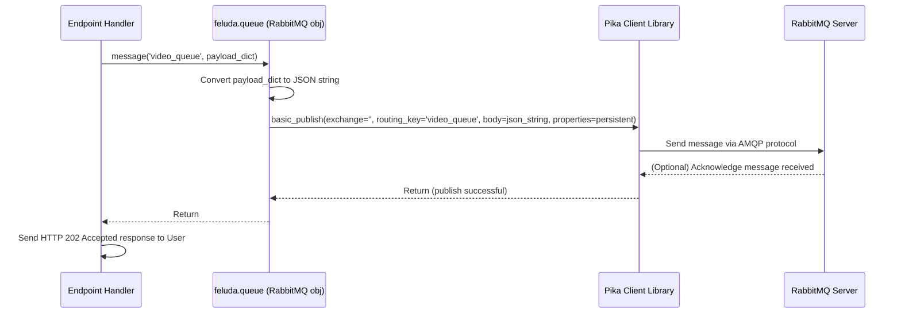

# Chapter 7: Queues

Welcome back! In [Chapter 6: Feluda Class (Orchestrator)](06_feluda_class__orchestrator__.md), we saw how the main `Feluda` class acts like a project manager, bringing together all the different parts like [Operators](03_operators_.md), [Stores](04_stores_.md), and the [Server & Endpoints](05_server___endpoints_.md) based on our `config.yml`.

Now, let's think about a common challenge. Imagine a user uploads a large video file to our Feluda application via the [Server & Endpoints](05_server___endpoints_.md). Feluda needs to process this video, perhaps extract keyframes, generate a vector representation using an [Operator](03_operators_.md), and save the results in a [Store](04_stores_.md). This processing might take several minutes!

If the server tries to do all this work immediately while the user is waiting, the user's request will "hang" for minutes, and the server might become slow or unresponsive to other users. This isn't a good experience. How can we handle these long-running tasks more gracefully?

That's where **Queues** come in!

**The Problem: Waiting in Line is Slow**

Think about sending a package. You *could* drive it directly to the recipient's house, wait for them to open it, and then drive back. This is like the server processing the video directly – it takes a long time and ties you (the server) up.

What if the task is really time-consuming, like building furniture from the package contents? You definitely wouldn't wait there for hours!

**The Solution: The Mailroom System (Queues)**

A much better approach is to use a mailroom or post office.

1.  **Drop Off:** You drop your package (the task, like "process this video") off at the mailroom counter.
2.  **Get Receipt:** The mailroom clerk gives you a receipt (a quick confirmation like "We got your task!"). You can now leave and do other things.
3.  **Background Work:** Later, specialized mailroom workers (we'll call them [Workers](08_workers_.md) in the next chapter) pick up packages from the mailroom sorting area.
4.  **Delivery/Processing:** A worker takes your package and delivers it or performs the requested action (processes the video).

This is exactly what Queues allow Feluda to do. Instead of the main server doing the heavy lifting immediately, it quickly puts a *message* describing the task onto a **message queue** (our digital mailroom) and sends a fast response back to the user ("Task submitted!"). Separate processes, called **Workers**, monitor this queue, pick up the task messages, and perform the actual time-consuming work in the background.

**Key Concepts**

1.  **Asynchronous Processing:** Doing tasks "out of sync" or "later" rather than immediately as part of the initial request. The server doesn't wait for the video processing to finish.
2.  **Message Queue:** A system (like RabbitMQ or AmazonMQ) that acts as the mailroom. It receives messages (tasks) from producers and holds them until consumers are ready.
3.  **Producer:** The part of the system that sends messages *to* the queue. In our case, this is usually the [Server & Endpoints](05_server___endpoints_.md) handler function.
4.  **Consumer (Worker):** A separate program that connects to the queue, receives messages, and processes the tasks described in them. We'll cover these in detail in [Chapter 8: Workers](08_workers_.md). This chapter focuses on setting up the queue and sending messages to it.

**How to Use Queues in Feluda**

Let's set up our mailroom and learn how the server can drop off a task.

**1. Configuration (Telling Feluda about the Mailroom)**

First, we need to tell Feluda which message queue system we want to use and how to connect to it. We do this in our `config.yml` file, similar to how we configure [Stores](04_stores_.md) or [Operators](03_operators_.md).

```yaml
# config.yml (Snippet)

queue:
  label: 'task_queue_system' # A name for this queue setup
  type: 'rabbitmq'           # Specify the type (e.g., 'rabbitmq' or 'amazonmq')
  parameters:
    # host_name: 'localhost' # Often set via environment variables now
    queues:
      - name: 'video_processing_queue' # Name of the specific queue for video tasks
      - name: 'image_indexing_queue'   # Maybe another queue for image tasks
    # Other parameters like username/password are usually set via
    # environment variables (e.g., MQ_USERNAME, MQ_PASSWORD, MQ_HOST)
```

*   This configuration tells Feluda to use `rabbitmq`.
*   It defines the logical names of the queues we want to use, like `video_processing_queue`.
*   Connection details (host, username, password) are typically loaded securely from environment variables (like `MQ_HOST`, `MQ_USERNAME`, `MQ_PASSWORD`) within the queue implementation code, rather than being written directly in the config file.

**2. Getting the Queue Ready (Orchestrator's Job)**

When Feluda starts, the [Feluda Class (Orchestrator)](06_feluda_class__orchestrator__.md) reads the `queue` section of the config. If it exists, it creates the appropriate Queue object (e.g., a `RabbitMQ` instance).

During the startup sequence (specifically in the `start_component` method), the orchestrator will typically:

*   Call the `connect()` method on the queue object to establish a connection to the RabbitMQ server.
*   Call the `initialize()` method to ensure the queues listed in the config (like `video_processing_queue`) actually exist on the RabbitMQ server (creating them if necessary).

```python
# Conceptual: How the Feluda class handles queue setup during start_component

# feluda_instance = Feluda("config.yml")
# ... other setup ...

# Inside feluda_instance.start_component(...):

# Check if a queue was configured and initialized
if feluda_instance.queue:
    log.info("Connecting queue...")
    # Establishes connection using details (likely from env vars)
    feluda_instance.queue.connect()
    # Creates queues like 'video_processing_queue' on the RabbitMQ server if they don't exist
    feluda_instance.queue.initialize()
    log.info("Queue connected and initialised.")

# Now feluda_instance.queue is ready to use!
```

**3. Sending a Task to the Queue (Producing)**

Now, let's modify our server endpoint handler. When it receives a request to process a large video, instead of doing the work itself, it will create a message and send it to the queue.

```python
# Simplified Example: Inside an Endpoint Handler (e.g., src/endpoint/index.py)
from flask import request, jsonify
# Assume 'self.feluda' gives access to the initialized Feluda instance

class IndexHandler:
    def __init__(self, feluda_instance):
        self.feluda = feluda_instance # Access to queue, etc.

    def handle_index_request(self):
        # --- Get request details (e.g., video URL, ID) ---
        data = request.get_json()
        video_url = data.get("media_url")
        media_id = data.get("id")
        media_type = data.get("media_type") # Should be 'video'

        if not video_url or not media_id or media_type != 'video':
            return jsonify({"error": "Missing required fields for video"}), 400

        # --- Prepare the task message ---
        task_payload = {
            "task_type": "process_video",
            "media_id": media_id,
            "video_url": video_url,
            "metadata": data.get("metadata", {})
            # Add any other info the Worker needs
        }

        # --- Send the message to the specific queue ---
        try:
            queue_name = 'video_processing_queue' # Target queue
            # Use the queue object initialized by the Feluda class
            self.feluda.queue.message(queue_name, task_payload)

            # --- Return a quick success response to the user ---
            return jsonify({
                "message": "Video processing task submitted successfully.",
                "task_id": media_id # Or some tracking ID
            }), 202 # HTTP 202 Accepted: Request received, processing will happen later

        except Exception as e:
            # Log the error
            print(f"Error sending task to queue: {e}")
            return jsonify({"error": "Failed to submit task"}), 500

```

**Explanation:**

1.  **Get Request:** The handler gets the video URL and ID from the incoming request.
2.  **Prepare Payload:** It creates a Python dictionary (`task_payload`) containing all the information the background worker will need to perform the task (what task it is, the video URL, etc.).
3.  **Send Message:** It calls `self.feluda.queue.message(queue_name, task_payload)`.
    *   `queue_name`: Specifies which queue to send it to (`video_processing_queue`).
    *   `task_payload`: The dictionary containing the task details. This dictionary is typically converted to a JSON string before being sent.
4.  **Respond Quickly:** Crucially, it immediately returns a success message (`HTTP 202 Accepted`) to the user *without* waiting for the video processing to finish.

The user gets a fast response, and the task is now waiting safely in the `video_processing_queue` for a [Worker](08_workers_.md) to pick it up.

**Under the Hood: Dropping off the Package**

Let's trace the steps when the server handler calls `feluda.queue.message()`:

1.  **Receive Call:** The `RabbitMQ` object's `message` method is called with the queue name and the payload dictionary.
2.  **Check Connection:** It might quickly check if the connection to the RabbitMQ server is still active. If not, it might try to reconnect (though robust handling is complex).
3.  **Serialize Payload:** The Python dictionary (`task_payload`) is converted into a standard format, usually a JSON string. This is the content of our "package".
4.  **Publish Message:** It uses the underlying `pika` library (the Python client for RabbitMQ) to publish the JSON string message to the specified queue (`video_processing_queue`) on the RabbitMQ server. It might set options to make the message "persistent" so it survives server restarts.
5.  **Confirmation (Optional):** RabbitMQ can be configured to send confirmations back, but often for speed, the producer might just send the message and assume it arrived (fire-and-forget).
6.  **Return:** The `message` method finishes, and control returns to the server endpoint handler, which then sends its HTTP response.

Here's a simplified sequence diagram of the server (Producer) sending a task message:



**Diving Deeper into the Code**

Let's look at simplified versions of the Feluda queue code.

**1. The Queue Factory (`src/core/queue/__init__.py`)**

This file acts like a dispatcher, choosing the right queue implementation (RabbitMQ, AmazonMQ) based on the `type` specified in `config.yml`.

```python
# Simplified from src/core/queue/__init__.py
import logging
from . import rabbit_mq # Import the RabbitMQ implementation code
from . import amazon_mq # Import the AmazonMQ implementation code
from core.config import QueueConfig # The config dataclass

log = logging.getLogger(__name__)

# Map type names (from config.yml) to the actual Queue classes
queues = {
    "rabbitmq": rabbit_mq.RabbitMQ,
    "amazonmq": amazon_mq.AmazonMQ
}

class Queue:
    # This class mainly holds the 'make' static method

    @staticmethod # Call directly on the class: Queue.make(...)
    def make(param: QueueConfig):
        """Creates an instance of the specified queue type."""
        try:
            # Get the queue type string (e.g., "rabbitmq") from config
            queue_type = param.type
            # Look up the corresponding class (e.g., rabbit_mq.RabbitMQ)
            QueueClass = queues[queue_type]
            # Create an instance of that class, passing its specific config
            queue_instance = QueueClass(param)
            return queue_instance
        except KeyError:
            log.error(f"Unsupported queue type: {param.type}")
            raise TypeError(f"Unsupported queue type: {param.type}")
        except Exception:
            log.exception("Invalid params passed to Queue")
            raise TypeError("Invalid params passed to Queue")

```

*   The `queues` dictionary maps the `type` string from the config to the actual Python class responsible for that queue system.
*   The static `make` method is called by the [Feluda Class (Orchestrator)](06_feluda_class__orchestrator__.md). It reads the `type` from the configuration, finds the right class in the `queues` dictionary, and creates an instance of it (e.g., `RabbitMQ(config)`).

**2. RabbitMQ Implementation (`src/core/queue/rabbit_mq.py`)**

This class handles the specifics of talking to RabbitMQ using the `pika` library.

```python
# Simplified from src/core/queue/rabbit_mq.py
import logging
from core.config import QueueConfig
import pika # The RabbitMQ client library
import json
from os import environ # To get credentials securely

log = logging.getLogger(__name__)

class RabbitMQ:
    def __init__(self, param: QueueConfig):
        """Stores config and gets connection details from environment."""
        self.mq_username = environ.get("MQ_USERNAME")
        self.mq_password = environ.get("MQ_PASSWORD")
        self.mq_host = environ.get("MQ_HOST") # Get host from environment
        # Store the list of queue names from config
        self.queues_to_declare = [q['name'] for q in param.parameters.queues]
        self.channel = None # Will hold the pika channel object

    def connect(self):
        """Establishes connection to the RabbitMQ server."""
        try:
            credentials = pika.PlainCredentials(self.mq_username, self.mq_password)
            connection_params = pika.ConnectionParameters(
                host=self.mq_host, credentials=credentials, heartbeat=600
            )
            connection = pika.BlockingConnection(connection_params)
            self.channel = connection.channel()
            log.info("Success Connecting to RabbitMQ")
        except Exception:
            log.exception("Error Connecting to RabbitMQ")
            raise Exception("Error connecting to RabbitMQ")

    def initialize(self):
        """Declares the required queues on the server."""
        if not self.channel:
            log.error("Cannot initialize queues, not connected.")
            return
        log.info("Declaring queues...")
        for queue_name in self.queues_to_declare:
            # durable=True makes the queue survive server restarts
            self.channel.queue_declare(queue=queue_name, durable=True)
            log.info(f"Queue Declared: {queue_name}")

    def is_connected(self):
        """Checks if the channel to RabbitMQ is open."""
        return self.channel and self.channel.is_open

    def message(self, queue_name, payload):
        """Sends a message to the specified queue."""
        if not self.is_connected():
            # Basic retry/reconnect logic (real-world might be more robust)
            log.warning("Not connected, attempting to reconnect...")
            self.connect()
            if not self.is_connected():
                log.error("Failed to send message, connection failed.")
                raise Exception("Connection unavailable")

        try:
            # Convert the payload dictionary to a JSON string
            message_body = json.dumps(payload)
            # Publish the message
            self.channel.basic_publish(
                exchange='', # Default exchange
                routing_key=queue_name, # The target queue name
                body=message_body,
                properties=pika.BasicProperties(
                    delivery_mode=2, # Make message persistent
                )
            )
            log.info(f"Sent message to queue: {queue_name}")
        except Exception:
            log.exception(f"Error sending message to queue: {queue_name}")
            raise Exception("Error sending message")

    # --- Methods used by Consumers (Workers) ---
    # def listen(self, queue_name, callback): ... (Covered in Chapter 8)
    # def close(self): ...
```

*   `__init__`: Stores the queue names from the config and gets connection details (`host`, `user`, `pass`) securely from environment variables.
*   `connect`: Uses `pika.BlockingConnection` and `pika.PlainCredentials` to connect to the RabbitMQ server and opens a `channel` for communication.
*   `initialize`: Uses `self.channel.queue_declare(..., durable=True)` to ensure each required queue exists on the server and will persist even if RabbitMQ restarts.
*   `message`: Converts the payload to JSON and uses `self.channel.basic_publish(...)` to send the message to the correct `routing_key` (the queue name). It sets `delivery_mode=2` to request that RabbitMQ saves the message to disk.

Feluda also provides a similar implementation for AmazonMQ (`src/core/queue/amazon_mq.py`) which uses `pika` but with different connection parameters (like SSL/TLS settings specific to AWS).

**Conclusion**

Queues are Feluda's solution for handling tasks that might take a long time, like processing large media files. They act like a digital mailroom:

*   The **Producer** (usually the server endpoint) quickly drops off a message describing the task onto a specific **Queue** (like `video_processing_queue`).
*   This allows the server to respond instantly to the user, improving responsiveness.
*   The task waits in the queue, managed by a system like RabbitMQ or AmazonMQ.

This decouples the initial request from the actual execution of the heavy work, making the application more scalable and robust. But who actually picks up the messages from the queue and does the work? That's the job of the Workers.

Let's find out how they operate in the final chapter: [Chapter 8: Workers](08_workers_.md).

---

Generated by [AI Codebase Knowledge Builder](https://github.com/The-Pocket/Tutorial-Codebase-Knowledge)