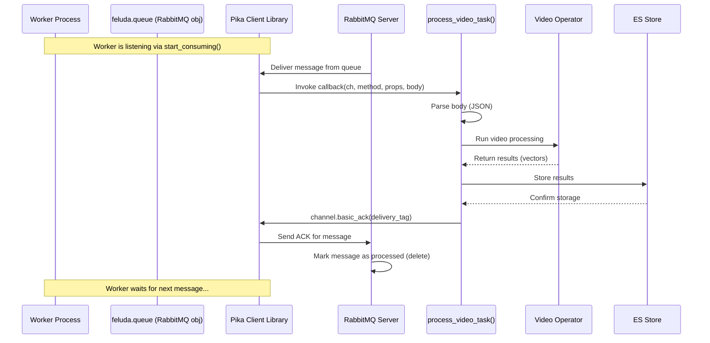

# Chapter 8: Workers

Welcome to the final chapter covering Feluda's core components! In [Chapter 7: Queues](07_queues_.md), we learned how Feluda uses a "mailroom" system (message queues like RabbitMQ) to handle tasks that might take a long time, like processing a large video. The server could quickly drop off a task message into the queue and respond to the user immediately.

But who actually goes into the mailroom, picks up those task messages, and does the work? Dropping off the package is only half the story! We need someone to handle the delivery and assembly. That's where **Workers** come in.

**The Problem: Who Does the Background Work?**

Imagine our mailroom (the queue) is filling up with task messages: "Process this video," "Analyze this audio file," "Generate a report." The server put them there, but the server's job is mainly to handle incoming requests quickly. It can't get bogged down doing all this lengthy processing itself.

We need dedicated entities whose sole job is to monitor the queues, grab the tasks, and perform the actual data processing.

**The Solution: Specialized Back-Office Employees (Workers)**

Think of **Workers** in Feluda as the specialized employees working in the back office. They don't interact directly with the customers (users sending requests to the server). Instead:

1.  They constantly watch the mailroom inbox (the **Queue**).
2.  When a new task message arrives, a Worker picks it up.
3.  They read the instructions in the message (e.g., "Process video at URL xyz").
4.  They use the company's tools (Feluda's [Operators](03_operators_.md)) to perform the task (like generating a video vector).
5.  They might access the company archives (Feluda's [Stores](04_stores_.md)) to save the results or look up related information.
6.  Once the task is complete, they inform the mailroom the job is done (acknowledge the message).

Workers are **independent background processes** specifically designed to consume messages from queues and execute the associated tasks.

**How Workers Operate**

Let's look at the typical lifecycle of a Feluda Worker:

1.  **Start Up:** A Worker is usually run as a separate Python script, often on a different server or machine than the main web server. It starts by initializing its own instance of the [Feluda Class (Orchestrator)](06_feluda_class__orchestrator__.md), often using a specific configuration file tailored for worker tasks (e.g., defining necessary operators and stores, but perhaps not a server).
2.  **Connect & Listen:** The Worker connects to the message queue system (like RabbitMQ) using the `feluda.queue` object. It then tells the queue, "I'm ready to receive messages from the `video_processing_queue`" (or whichever queue it's assigned to). This is typically done using a `listen()` method.
3.  **Wait:** The Worker waits patiently for a message to arrive in its assigned queue.
4.  **Receive Message:** When the queue system delivers a message, the Worker receives it. The message usually contains a payload (often JSON) with task details (like the video URL, task ID, etc.).
5.  **Execute Task (Callback Function):** The core logic of the Worker resides in a **callback function** that you define. This function is automatically executed when a message is received. Inside this function:
    *   The message payload is parsed (e.g., from JSON to a Python dictionary).
    *   It might use the [Media Handling (Types & Factory)](02_media_handling__types___factory__.md) to fetch the media data (e.g., download the video).
    *   It calls the necessary [Operators](03_operators_.md) to perform the analysis (e.g., `vid_vec_rep_resnet.run(video_data)`).
    *   It might use the [Stores](04_stores_.md) to save the results (e.g., `feluda.store['es_vec'].store(...)`).
    *   It might even send *new* messages to other queues (e.g., a "reporting" queue to signal task completion status).
6.  **Acknowledge Message:** This is crucial! Once the task is successfully completed, the Worker sends an "acknowledgment" back to the queue system. This tells the queue, "I finished processing this message, you can safely remove it." If the Worker crashes *before* acknowledging, the queue system understands the task wasn't finished and can redeliver the message to another Worker (or the same one when it restarts), ensuring tasks don't get lost. If processing fails, the worker might send a "negative acknowledgment" (`nack`) which could tell the queue to discard the message or requeue it.
7.  **Loop:** The Worker goes back to step 3, waiting for the next message.

**Running a Worker**

Workers aren't typically started by the main web server. You run them as separate, long-running processes. For example, you might have a script like `src/worker/vidvec/video_worker.py` and run it from your terminal:

```bash
# Example command to start a video processing worker
python src/worker/vidvec/video_worker.py
```

This script would perform the setup (steps 1-2 above) and then enter the listening loop (steps 3-7). You can run multiple instances of the same worker script (even on different machines) to process tasks from the same queue in parallel, allowing you to scale your processing power.

**Example Worker Script Structure**

Let's look at a highly simplified structure for a worker script that processes video vectors.

```python
# Simplified worker script (e.g., video_worker.py)

import logging
import json
from core.feluda import Feluda, ComponentType
from core.models.media import MediaType
from core.models.media_factory import VideoFactory
# Assume operators like vid_vec_rep_resnet are imported

log = logging.getLogger(__name__)
logging.basicConfig(level=logging.INFO)

# --- 1. Define the Callback Function (The actual task logic) ---
def create_video_processing_callback(feluda_instance):
    """Creates the function that handles incoming messages."""

    def process_video_task(channel, method, properties, body):
        """This function gets called for each message."""
        log.info("Received a video processing task!")
        try:
            # a. Parse the message payload
            task_data = json.loads(body)
            video_url = task_data.get("video_url")
            media_id = task_data.get("media_id")
            log.info(f"Processing video: {media_id} from {video_url}")

            # b. Fetch media (simplified)
            video_data = VideoFactory.make_from_url(video_url)

            # c. Run Operator (get the right operator instance)
            video_op = feluda_instance.operators.get_operator('operators.vid_vec_rep_resnet.vid_vec_rep_resnet') # Example path
            video_vectors = video_op.run(video_data) # This might yield multiple vectors

            # d. Store Results (simplified - actual storage might loop through vectors)
            # Assuming es_vec store is configured
            es_store = feluda_instance.store.get("es_vec")
            if es_store:
                first_vector_doc = {"e_kosh_id": media_id, "vid_vec": next(video_vectors)['vid_vec'], "processed": True} # Simplified doc
                es_store.store(MediaType.VIDEO, first_vector_doc)
                log.info(f"Stored vector for {media_id}")

            # e. Acknowledge the message!
            log.info(f"Task for {media_id} completed successfully.")
            channel.basic_ack(delivery_tag=method.delivery_tag)

        except Exception as e:
            log.error(f"Error processing task {media_id}: {e}")
            # In case of error, NEGATIVELY acknowledge.
            # This might requeue the message or send it to a dead-letter queue.
            channel.basic_nack(delivery_tag=method.delivery_tag, requeue=False)

    return process_video_task # Return the inner function

# --- 2. Main Worker Setup ---
if __name__ == "__main__":
    log.info("Starting Video Worker...")
    try:
        # a. Initialize Feluda (reads config, sets up components)
        #    Workers often use a specific config file (e.g., config-worker.yml)
        feluda = Feluda("config-worker.yml")
        feluda.setup() # Initialize operators

        # b. Connect required components (Store, Queue)
        #    Must connect BEFORE listening
        feluda.start_component(ComponentType.STORE)
        feluda.start_component(ComponentType.QUEUE)

        # c. Get the name of the queue to listen to from config
        #    Assuming the first queue in config is the video queue
        queue_name = feluda.config.queue.parameters.queues[0]["name"]
        log.info(f"Worker ready. Listening to queue: {queue_name}")

        # d. Create the callback function instance
        the_actual_callback = create_video_processing_callback(feluda)

        # e. Start listening! This blocks and waits for messages.
        feluda.queue.listen(queue_name, the_actual_callback)

    except Exception as e:
        log.exception(f"Worker failed to initialize or run: {e}")

    log.info("Video Worker stopped.")

```

**Explanation:**

1.  **Callback Definition:** We define a function (`process_video_task`) that contains the logic for handling *one* message. It takes parameters like `channel`, `method`, `body` provided by the queue library (`pika`). It's wrapped in another function (`create_video_processing_callback`) to easily pass the `feluda_instance` (giving access to operators/stores) into the callback's scope.
2.  **Main Setup:**
    *   Initialize `Feluda`, which loads the configuration (`config-worker.yml`) and sets up the needed components (Operators, Stores, Queue client).
    *   Call `feluda.setup()` to initialize operators (e.g., load ML models).
    *   Call `feluda.start_component()` for `STORE` and `QUEUE` to connect to the database and the message broker.
    *   Determine the specific `queue_name` the worker should listen to (read from the loaded config).
    *   Create an instance of the callback function, passing the `feluda` instance.
    *   Call `feluda.queue.listen(queue_name, the_actual_callback)`. This is the crucial step that starts the worker's main loop, waiting for and processing messages using our defined callback.

**Under the Hood: Listening and Acknowledging**

What happens when `feluda.queue.listen(queue_name, callback)` is called?

1.  **Start Consumption:** The method (e.g., inside the `RabbitMQ` class in `src/core/queue/rabbit_mq.py`) uses the underlying library (`pika`) to tell the RabbitMQ server: "Start sending me messages from `queue_name`. When you send one, invoke the function `callback`." This is often done via `channel.basic_consume(queue=queue_name, on_message_callback=callback)`.
2.  **Enter Loop:** The method then typically enters a blocking loop (`channel.start_consuming()`). The worker process now just waits.
3.  **Message Arrives:** RabbitMQ pushes a message from the queue to the worker.
4.  **Invoke Callback:** The `pika` library receives the message and calls the registered `callback` function (our `process_video_task`), passing the channel, delivery metadata (`method`), properties, and the message body.
5.  **Callback Executes:** Our code inside `process_video_task` runs.
6.  **Acknowledge:** If our code successfully finishes and calls `channel.basic_ack(delivery_tag=method.delivery_tag)`, the `pika` library sends an acknowledgment back to RabbitMQ. RabbitMQ then knows it can safely delete the message from the queue. If `basic_nack` is called, a negative acknowledgment is sent.
7.  **Wait Again:** The `start_consuming()` loop continues, waiting for the next message.

Here's a simplified diagram showing a worker processing one message:



**Diving Deeper: `listen` and Acknowledgements**

Let's peek at the simplified `listen` method within the `RabbitMQ` queue class (`src/core/queue/rabbit_mq.py`).

```python
# Simplified from src/core/queue/rabbit_mq.py
import logging
# ... other imports like pika ...

log = logging.getLogger(__name__)

class RabbitMQ:
    # ... (__init__, connect, initialize, message methods) ...

    def listen(self, queue_name, callback):
        """Starts listening to a queue and processing messages with callback."""
        if not self.channel or not self.channel.is_open:
            log.error(f"Cannot listen to {queue_name}, channel not open.")
            # Potentially raise an error or attempt reconnect
            return

        try:
            # Tell RabbitMQ to send messages to our 'callback' function.
            # 'auto_ack=False' is VITAL - we will manually acknowledge later.
            self.channel.basic_consume(
                queue=queue_name,
                on_message_callback=callback,
                auto_ack=False # We MUST explicitly call basic_ack or basic_nack
            )

            log.info(f"[*] Waiting for messages on queue '{queue_name}'. To exit press CTRL+C")
            # Start the blocking loop - Pika will handle calling 'callback'
            self.channel.start_consuming()

        except KeyboardInterrupt:
            log.info("Worker stopped by user (CTRL+C).")
            self.channel.stop_consuming()
        except Exception as e:
            log.exception(f"Error while consuming messages from {queue_name}: {e}")
            # Potentially try to restart consumption after a delay
        finally:
            # Ensure connection is closed cleanly if loop exits
            if self.channel and self.channel.is_open:
                self.channel.close()
            if self.channel and self.channel.connection.is_open:
                 self.channel.connection.close()
            log.info("RabbitMQ connection closed.")

    # Callback function (defined outside this class, passed in as 'callback')
    # needs to handle message body parsing and call:
    # channel.basic_ack(delivery_tag=method.delivery_tag) on success
    # channel.basic_nack(delivery_tag=method.delivery_tag, requeue=...) on failure
```

*   `basic_consume`: This tells `pika` to register our `callback` function for the specified `queue_name`. `auto_ack=False` is critical; it means we are responsible for acknowledging messages. If this were `True`, the message would be acknowledged (and removed from the queue) the moment the worker receives it, even if processing fails later.
*   `start_consuming`: This starts the main loop that waits for messages and triggers the callback. It blocks the script's execution here.
*   **Manual Acknowledgement:** The callback function *must* call either `channel.basic_ack(...)` on success or `channel.basic_nack(...)` on failure to properly inform RabbitMQ about the fate of the message. The `delivery_tag` needed for these calls is provided to the callback function via the `method` argument.

**Conclusion**

Workers are the essential background processors in Feluda's asynchronous task system. They complement [Chapter 7: Queues](07_queues_.md) by providing the mechanism to actually *execute* the tasks submitted to those queues.

*   They run as **independent processes**, typically started separately.
*   They **listen** to specific queues for incoming task messages.
*   They use a **callback function** to process messages, leveraging Feluda's [Operators](03_operators_.md), [Stores](04_stores_.md), and [Media Handling (Types & Factory)](02_media_handling__types___factory__.md).
*   They **acknowledge** messages back to the queue to ensure reliable processing.

Using Queues and Workers allows you to build robust, scalable Feluda applications that can handle long-running tasks efficiently without impacting the responsiveness of the main server interface.

This concludes our tour of the core components of the Feluda framework! You've learned about configuration, media handling, operators, stores, the server, the orchestrator, queues, and now workers – giving you a solid foundation for understanding and building with Feluda.

---

Generated by [AI Codebase Knowledge Builder](https://github.com/The-Pocket/Tutorial-Codebase-Knowledge)