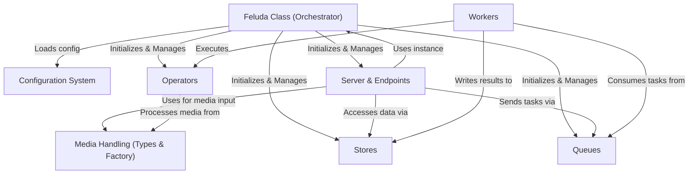

# Tutorial: Feluda Documentation

Feluda is a system for *multimedia analysis* and *search*. It uses a **Configuration System** (`config.yml`) to set up its various parts.
It handles different **Media Types** (like images, videos, audio, text) using a standard approach. Specialized **Operators** perform tasks like extracting vector features or detecting text within media.
These results can be saved in pluggable **Stores** (like Elasticsearch). Feluda uses **Queues** and background **Workers** to process heavy tasks asynchronously, improving performance.
Finally, a **Server** exposes Feluda's capabilities (like indexing and searching) through a web API. The **Feluda Class** acts as the central orchestrator, bringing all these components together.

**Source Repository:** [https://github.com/Rajat-Yd/feluda](https://github.com/Rajat-Yd/feluda)

## Chapters

1. [Configuration System
](01_configuration_system_.md)
2. [Media Handling (Types & Factory)
](02_media_handling__types___factory__.md)
3. [Operators
](03_operators_.md)
4. [Stores
](04_stores_.md)
5. [Server & Endpoints
](05_server___endpoints_.md)
6. [Feluda Class (Orchestrator)
](06_feluda_class__orchestrator__.md)
7. [Queues
](07_queues_.md)
8. [Workers
](08_workers_.md)

---

Generated by [AI Codebase Knowledge Builder](https://github.com/The-Pocket/Tutorial-Codebase-Knowledge)